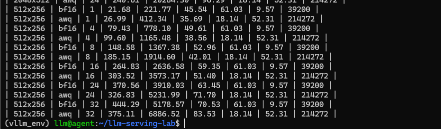
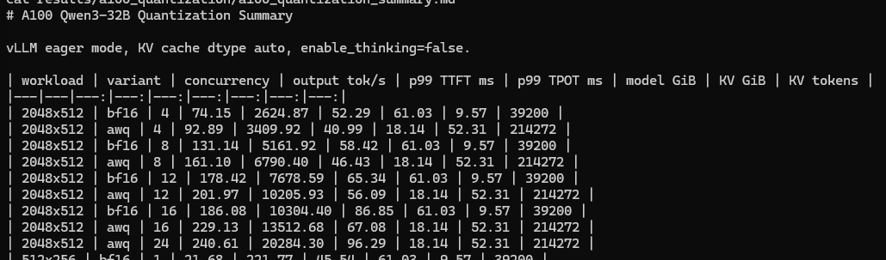
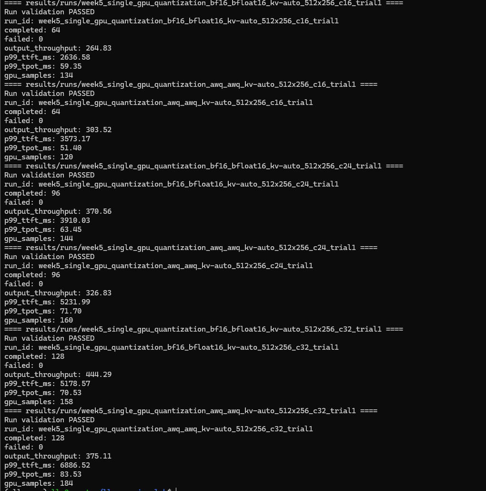
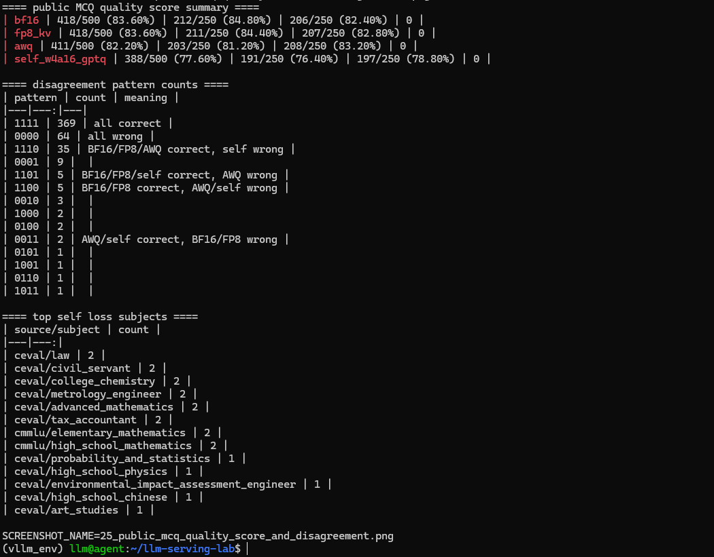

# 从 GB10 自行量化到 A100 部署：Qwen3-32B 四路径对比

这篇文章记录一次完整的 Qwen3-32B 量化工程实验：先在 NVIDIA GB10 上使用公开 WikiText-2 校准集完成 W4A16 GPTQ 后训练量化，再把 18G 量化产物部署到单张 A100 80GB，最后与 BF16、BF16 + FP8 KV Cache、官方 Qwen3-32B-AWQ 使用同一套 vLLM runner 做资源和服务性能对比。

这次工作不只是在服务器上“跑一个量化模型”，而是打通了校准数据、量化 recipe、故障排查、产物完整性、跨机传输、推理兼容、基准对齐和结果验收。

先说明最重要的边界：自行量化模型使用 `llm-compressor GPTQModifier`，应称为 **self-built W4A16 GPTQ** 或 **compressed-tensors W4A16 GPTQ**。它不是 self-AWQ，也不是自行发明的 GPTQ 算法。本文同时完成服务性能和固定 500 题中文 MCQ 质量回归；结果显示 self 性能具有竞争力，但质量低于 BF16 和官方 AWQ。**吞吐更高不代表回答质量更好。**

## 实验目标

实验集中回答以下问题：

1. 能否用公开数据构造可复现、可审计的 Qwen3-32B PTQ 校准集？
2. GB10 能否完成 32B 模型的 W4A16 GPTQ 并输出可部署产物？
3. 该产物能否被 GB10 和 A100 上的 vLLM 正常加载和生成？
4. 与 BF16、FP8 KV Cache 和官方 AWQ 相比，它节省了多少模型内存，又释放了多少 KV Cache？
5. 在统一请求长度、并发和 compute dtype 后，四条路径的吞吐、P99 TTFT、P99 TPOT 有何差异？
6. 在有限请求到达率下，四条路径满足统一 P99 SLO 的最高 goodput 是多少？
7. 在相同固定质量集、解码参数和评分方法下，四条路径的质量差异是多少？

## 两端实验环境

量化与推理基准分别在两台机器上完成。

| 环节 | 硬件与软件环境 |
|---|---|
| GB10 量化端 | NVIDIA GB10、Ubuntu 24.04.3、CUDA 13.0、PyTorch 2.12.0+cu130、Transformers 5.10.1、llm-compressor 0.12.0.1、compressed-tensors 0.17.1 |
| A100 推理端 | 2 x A100 80GB PCIe，基准固定 GPU 0 单卡；vLLM 0.19.0、PyTorch 2.10.0+cu128、Torch CUDA 12.8、Driver 580.173.02 |

两端软件版本并不完全相同，因此模型产物不能只在量化环境中自证可用。实验分别在 GB10 和 A100 上完成加载与生成，跨机后还用 SHA256 检查权重文件是否一致。

## 使用 WikiText-2 构造校准集

校准数据选择 `Salesforce/wikitext` 的 `wikitext-2-raw-v1/train`。它公开、经典、体积小，适合建立第一条通用语言模型 PTQ 流程。需要注意的是，校准集用于提供激活分布，不等于质量测试集。

GB10 当时无法稳定连接 Hugging Face，因此最终在 Windows 下载官方 parquet，再离线传入 GB10。源文件 SHA256 为：

```text
e83889baabc497075506f91975be5fac0d45c5290b6b20582c8cd1e853d0c9f7
```

构造后的正式校准集包含 128 条样本，每条 2048 tokens，总计 262,144 tokens。每条样本都使用 Qwen3-32B 自己的 tokenizer 复核长度。WikiText-2 以英文百科文本为主，所以它足以支撑本轮通用 PTQ 实验，但不能覆盖中文、代码或真实业务分布。

## 在 GB10 上完成 W4A16 GPTQ

量化使用 `llm-compressor 0.12.0.1` 的 `GPTQModifier`。核心设置为 INT4 权重、group size 128、symmetric、group strategy、static actorder，目标模块为 `Linear`，忽略 `lm_head`。

正式量化 run：

```text
run_id=qwen3_32b_w4a16_gptq_wikitext2_20260804-083345
started_at=2026-08-04T08:33:45
finished_at=2026-08-04T10:36:40
status=completed
```

量化方法、校准集与完成状态以原始实验记录和 run manifest 为证据；对应的终端截图未纳入本公开副本。

量化过程并非一次顺利完成。最初把 JSONL 文件路径作为 `dataset_path` 交给 oneshot，pipeline 最终得到 `dataloader=None`：

```text
TypeError: 'NoneType' object is not iterable
```

正式修复是读取 JSONL 后使用 Hugging Face `Dataset.from_list` 构造 dataset 对象，再将对象传入 oneshot。

另一个容易误判的阶段是：65 层 propagation 完成后，进度长时间停留在 `Compressing model: 0/448`。此时 GPU 利用率很低，但 Python 进程仍存活，容器内存仍约 71 GiB。继续等待后，压缩阶段在约 37 分钟内完成了 448 个模块。只盯着 GPU 利用率或进度条，很容易误杀仍在工作的任务。

最终产物信息：

```text
directory_size=18G
model.safetensors=19,203,594,000 bytes
quant_method=compressed-tensors
format=pack-quantized
quantization_status=compressed
SHA256=eb753007b304287162dc588dee1f4fbad0c3c751ae9a87af6b5a2ce8e980b560
```

## 从 GB10 迁移到 A100

量化产物先在 GB10 上做 vLLM smoke。期间发现 `tokenizer_config.json` 中 list-valued `extra_special_tokens` 与目标 Transformers fast tokenizer 不兼容；备份配置后删除该字段，模型成功加载并完成生成。

首次 rsync 又因 `model.safetensors` 权限不足失败。修正文件可读权限后重新传输，并在 A100 上核对 SHA256。两端 hash 完全一致，排除了 18G 文件跨机传输损坏的风险。

A100 上的 vLLM 能根据模型 `config.json` 自动识别 compressed-tensors 格式，因此自行模型的服务配置中不传 `quantization: awq`。它不是 AWQ 模型，强行指定 AWQ 后端反而会造成格式与运行路径不匹配。

自行量化产物完整性、W4A16 配置与 A100 资源以 SHA256、配置文件和结果 manifest 为证据；对应的终端截图未纳入本公开副本。

## 四条对比路径

| variant | 模型或量化路径 | compute dtype | KV dtype |
|---|---|---|---|
| BF16 | Qwen3-32B 原模型 | bfloat16 | auto |
| FP8 KV | Qwen3-32B 原模型 | bfloat16 | fp8 |
| 官方 AWQ | Qwen3-32B-AWQ | float16 | auto |
| self W4A16 GPTQ | 自行 compressed-tensors W4A16 | float16 | auto |

所有路径固定单张 A100 80GB、vLLM 0.19.0、eager mode、`max_model_len=8192`、`gpu_memory_utilization=0.90`、`enable_thinking=false` 和无限 request rate。

正式工作负载包括：

- `512x256`：并发 c4、c8、c16、c24、c32。
- `2048x512`：并发 c4、c8、c12、c16。
- 官方 AWQ 另有一个 `2048x512 c24` 容量观察点。

这里发生过两次基准对齐修正。

第一次，自行模型最初配置为 `dtype:auto`，实际解析为 bfloat16，而官方 AWQ 使用 float16。为了减少未控制变量，我将 9 个 self 配置全部改为 `dtype: float16` 并重跑。旧 auto 结果只保留为探索数据。

第二次，self 的 `2048x512 c4` 初始使用 64 prompts，而历史 BF16、FP8 KV、官方 AWQ 都使用 16 prompts。正式矩阵将 self c4 改为 16 prompts 重跑，四条路径最终均为 completed 16、failed 0。

公平的比较不只是模型名字相同，还必须检查 compute dtype、请求数、请求长度、并发、KV dtype 和服务参数。

## 资源容量对比

| variant | model loading memory | available KV cache | GPU KV tokens | max conc @8192 |
|---|---:|---:|---:|---:|
| BF16 | 61.03 GiB | 9.57 GiB | 39,200 | 4.79x |
| FP8 KV | 61.03 GiB | 9.57 GiB | 78,400 | 9.57x |
| 官方 AWQ | 18.14 GiB | 52.31 GiB | 214,272 | 26.16x |
| self W4A16 GPTQ | 18.03 GiB | 52.58 GiB | 215,344 | 26.29x |

自行 W4A16 相比 BF16 将模型加载内存降低约 70.5%，并把 KV token 容量提高到约 5.49 倍。它与官方 AWQ 的资源结果同量级，但两者使用不同量化算法和格式，资源接近不能推导输出质量等价。

FP8 KV Cache 的作用不同：它不改变 61.03 GiB 的 BF16 权重内存，而是降低每个 token 的 KV 占用，因此在相同 9.57 GiB KV memory 下把 token 容量翻倍。

## 512x256：短负载结果

| c | BF16 tok/s | FP8 KV tok/s | AWQ tok/s | self tok/s | BF16 P99 TTFT | FP8 KV P99 TTFT | AWQ P99 TTFT | self P99 TTFT | BF16 P99 TPOT | FP8 KV P99 TPOT | AWQ P99 TPOT | self P99 TPOT |
|---:|---:|---:|---:|---:|---:|---:|---:|---:|---:|---:|---:|---:|
| 4 | 79.43 | 79.45 | 99.60 | 95.91 | 778.10 | 778.96 | 1165.48 | 843.44 | 49.61 | 49.57 | 38.56 | 40.52 |
| 8 | 148.58 | 149.22 | 185.15 | 179.56 | 1367.38 | 1382.72 | 1914.60 | 1676.12 | 52.96 | 52.64 | 42.01 | 43.71 |
| 16 | 264.83 | 267.69 | 303.52 | 312.90 | 2636.58 | 2712.30 | 3573.17 | 3322.15 | 59.35 | 58.67 | 51.40 | 50.23 |
| 24 | 370.56 | 374.49 | 326.83 | 408.80 | 3910.03 | 3893.62 | 5231.99 | 4937.47 | 63.45 | 62.82 | 71.70 | 57.55 |
| 32 | 444.29 | 452.19 | 375.11 | 494.32 | 5178.57 | 5208.28 | 6886.52 | 6600.16 | 70.53 | 69.03 | 83.53 | 63.03 |



如果使用示例 SLO `P99 TTFT <= 4s` 且 `P99 TPOT <= 60ms`，四条路径在 `512x256` 下最大合格并发均为 c16。该点的 output throughput 为：

| variant | tok/s | 相比 BF16 |
|---|---:|---:|
| BF16 | 264.83 | 基线 |
| FP8 KV | 267.69 | +1.1% |
| 官方 AWQ | 303.52 | +14.6% |
| self W4A16 GPTQ | 312.90 | +18.1% |

self 在这个点位比官方 AWQ 高约 3.1%，但不能概括为自行模型全面优于官方 AWQ。c4、c8 时官方 AWQ 的吞吐更高，说明性能排序会随并发变化。

c24、c32 的裸吞吐继续提高，但 TTFT 或 TPOT 已超过示例 SLO。最高 tok/s 并不自动等于最适合上线的工作点。

## 2048x512：长负载结果

| c | BF16 tok/s | FP8 KV tok/s | AWQ tok/s | self tok/s | BF16 P99 TTFT | FP8 KV P99 TTFT | AWQ P99 TTFT | self P99 TTFT | BF16 P99 TPOT | FP8 KV P99 TPOT | AWQ P99 TPOT | self P99 TPOT |
|---:|---:|---:|---:|---:|---:|---:|---:|---:|---:|---:|---:|---:|
| 4 | 74.15 | 74.84 | 92.89 | 90.24 | 2624.87 | 2715.00 | 3409.92 | 3266.04 | 52.29 | 51.87 | 40.99 | 41.14 |
| 8 | 131.14 | 133.04 | 161.10 | 158.82 | 5161.92 | 5269.38 | 6790.40 | 6567.97 | 58.42 | 57.47 | 46.43 | 47.13 |
| 12 | 178.42 | 181.77 | 201.97 | 190.85 | 7678.59 | 7872.75 | 10205.93 | 9919.23 | 65.34 | 63.27 | 56.09 | 56.35 |
| 16 | 186.08 | 217.52 | 229.13 | 243.84 | 10304.40 | 10593.13 | 13512.68 | 13158.82 | 86.85 | 70.69 | 67.08 | 62.31 |



self 在 c4 到 c12 略低于官方 AWQ，在 c16 的吞吐高于官方 AWQ。更准确的描述是：两种 4-bit 权重量化路径表现同量级，但随着并发和请求长度变化会出现不同交叉点。

长负载也更清楚地说明了“容量”和“SLO”不是一回事。4-bit 权重量化释放了大量 KV 空间，使模型具备承载更多长请求的资源条件；但随着并发增加，P99 TTFT 仍会快速上升。官方 AWQ 的额外 c24 点能够完成请求，但 P99 TTFT 已超过 20 秒、P99 TPOT 约 96 ms。能装得下，不代表延迟可接受。

## 从峰值吞吐走向 Open-Loop Goodput

闭环并发矩阵回答的是“客户端持续填满固定并发时，系统能跑多快”。真实服务还有另一个问题：请求按某个速率持续到达时，系统是否仍能把尾延迟控制在业务门限内？这就是开环测试要回答的问题。

我固定 `512x256` 工作负载、每点 128 个请求和 `max_concurrency=32`，将 request-rate 设为有限值。四条路径都使用与正式矩阵一致的模型、dtype、KV cache 和解码参数。SLO 统一定义为：

```text
failed = 0
P99 TTFT <= 4000 ms
P99 TPOT <= 60 ms
```

标准阶梯覆盖 `0.6/0.8/1.0/1.1/1.2 req/s`。为了真正找到边界，而不是停在“至少能到这里”，我又为 AWQ 补测 `0.4/0.5`，为 self 补测 `1.3/1.4/1.5`。最终形成 25 个正式点，全部完成 128/128，失败数均为 0。



最终边界如下：

| variant | 最高通过 rate | actual req/s | output tok/s | P99 TTFT | P99 TPOT |
|---|---:|---:|---:|---:|---:|
| BF16 | 0.6 | 0.567 | 145.04 | 481.19 ms | 59.75 ms |
| FP8 KV | 0.6 | 0.567 | 145.08 | 485.38 ms | 59.32 ms |
| 官方 AWQ | 0.5 | 0.482 | 123.30 | 830.28 ms | 56.47 ms |
| self W4A16 GPTQ | 1.3 | 1.179 | 301.82 | 753.33 ms | 58.54 ms |

开环 request-rate 阶梯的详细结果保留在表格和 manifest 中；当前副本只保留统一的 SLO 边界图。

在这套 SLO 下，最终限制因素不是 TTFT，而是 60 ms 的 P99 TPOT 门限。BF16 和 FP8 KV 在 `0.8 req/s` 分别达到 62.71 ms 和 61.85 ms；AWQ 在 `0.6 req/s` 达到 61.14 ms；self 在 `1.4 req/s` 达到 60.95 ms。于是 self 的最高已验证合格点落在 `1.3 req/s`，对应 `301.82 output tok/s`。

这个结果比单纯比较峰值 tok/s 更接近容量规划：它给出的不是“跑到极限还能完成多少”，而是“满足指定尾延迟时可以承诺多少”。但它仍然是当前 A100、vLLM 版本、随机 `512x256` 负载和这组 SLO 下的结果，不能外推为所有业务场景的固定倍率。

更重要的是，goodput 领先仍然不等于内容质量领先。接下来的固定 500 题回归会给出另一条独立证据线。

## 固定 500 题质量回归

性能矩阵完成后，我没有用“请求成功”代替质量结论，而是为四条路径建立同一套可复现的中文选择题回归集。

题集由两部分组成：

| 数据集 | split | 题数 | 学科覆盖 |
|---|---|---:|---:|
| C-Eval | val | 250 | 52 个学科 |
| CMMLU | test | 250 | 67 个学科 |

抽样种子固定为 `20260804`。每道题都使用同一个提示模板，要求模型只输出 A/B/C/D；四条路径统一 `temperature=0`、`max_tokens=8`、关闭 thinking，并使用同一答案抽取和精确匹配规则。500 题答案分布为 A=121、B=131、C=131、D=117。

原始公开数据快照不提交 GitHub，只保留本次使用的固定 JSONL、manifest、runner 和结果摘要。这既让仓库保持轻量，也保证后续更换量化方案时仍使用完全相同的回归题。

固定 500 题质量集、抽样清单与题目样例以公开数据集 manifest 和结果摘要为证据；原始终端截图未纳入本公开副本。

四个正式 run 均完成 500/500，失败、空输出和无效答案均为 0。最终结果如下：

| variant | overall | C-Eval | CMMLU | invalid |
|---|---:|---:|---:|---:|
| BF16 | 418/500（83.60%） | 84.80% | 82.40% | 0 |
| FP8 KV | 418/500（83.60%） | 84.40% | 82.80% | 0 |
| 官方 AWQ | 411/500（82.20%） | 81.20% | 83.20% | 0 |
| self W4A16 GPTQ | 388/500（77.60%） | 76.40% | 78.80% | 0 |

FP8 KV 与 BF16 总分一致，说明在这套短选择题回归中没有观察到总准确率下降。官方 AWQ 比 BF16 低 1.4 个百分点，仍然接近基线。self 比 BF16 低 6.0 个百分点、比官方 AWQ 低 4.6 个百分点，因此不能宣称质量无损，也不能因为某些性能点更快就说它“优于官方 AWQ”。

逐题分歧审计进一步给出了可操作的优化入口：369 题四条路径全部正确，64 题全部错误；有 35 题是 BF16、FP8 KV、官方 AWQ 正确而 self 错误。这 35 题会成为后续更换中文校准集或 GPTQ recipe 时最重要的回归样本。



这套 500 题是项目内固定子集回归测试，不是 C-Eval 或 CMMLU 官方完整榜单。它能回答“同一批题上四条路径相差多少”，但不能替代代码执行、数学推理、长文本、业务问答或人工偏好评测。

## 结果验收与结论边界

self 的 9 个正式 FP16 compute run 均为 `status=validated`、`failed=0`。最终合并 CSV 包含 37 行，失败总数 0、重复键 0、空单元格 0。BF16、FP8 KV 和 self 各 9 行，官方 AWQ 10 行，多出的 1 行是 `2048x512 c24`。

开环侧共有 25 个正式点，全部完成 128/128 且 failed=0。最终 CSV 同时记录 configured request-rate、actual req/s、output tok/s、P99 TTFT、P99 TPOT 和 SLO pass，且为每条路径找到了最高通过点及下一失败点。

性能侧，这些结果证明自行 W4A16 产物可被 GB10 和 A100 的 vLLM 加载，OpenAI-compatible API 可以正常生成，9 个正式性能点位没有请求失败，资源、吞吐和延迟数据可进入统一矩阵比较。

质量侧，四路径同一固定子集已经证明 self 存在可测下降。本文因此可以说“质量差距已被量化”，但仍不能说 self 质量无损或优于官方 AWQ，也不能把固定子集分数外推到所有任务。

## 这次实验真正有价值的地方

第一，量化实验需要可审计。校准数据来源、源文件 hash、token 数、recipe、软件版本、产物 hash 和 run manifest 都应该被记录，否则很难复现，也无法确认最终比较的是哪个模型。

第二，模型格式与运行后端必须匹配。官方 AWQ 显式使用 AWQ 路径；自行模型由 vLLM 自动识别 compressed-tensors。二者都属于 4-bit 权重量化，但不能混成一个 variant。

第三，公平比较需要主动审计变量。`dtype:auto` 与 `float16`、16 prompts 与 64 prompts，看起来只是配置细节，却足以让一张矩阵失去严格可比性。发现问题后重跑，比为已有结果找解释更重要。

第四，资源收益、服务性能和输出质量是三个不同问题。W4A16 可以显著降低权重内存，FP8 KV 可以扩大 KV token 容量；本轮 500 题结果又证明性能领先与质量领先并不等价。最终线上配置仍要同时看 TTFT、TPOT、请求长度、并发、质量和业务 SLO。

第五，质量评测不仅要给一个总分，还要保留逐题结果和分歧模式。`1110` 的 35 道题把“self 质量下降”从一句模糊判断变成了下一轮可以直接回归的样本集合。

第六，峰值吞吐和 goodput 是两套口径。闭环 c32 的高 tok/s 不能直接作为线上承诺；只有把失败率和 P99 延迟纳入 request-rate 阶梯，才能得到可解释的 SLO 工作点。

## 结论与下一步

本次实验完成了从 GB10 校准量化到 A100 四路径基准的完整工程闭环。自行 compressed-tensors W4A16 GPTQ 产物约 18G，在 A100 上模型加载内存为 18.03 GiB，可用 KV cache 为 52.58 GiB，GPU KV tokens 为 215,344，资源表现与官方 AWQ 同量级。

在统一 FP16 compute 后，self 的 9 个闭环性能点全部通过验证。在 `512x256` 开环测试中，它在 `1.3 req/s` 达到 `301.82 output tok/s`，P99 TTFT 为 753.33 ms、P99 TPOT 为 58.54 ms；下一点 `1.4 req/s` 因 TPOT 60.95 ms 越过 SLO。固定 500 题质量回归中，self 为 77.60%，低于 BF16 的 83.60% 和官方 AWQ 的 82.20%。当前数据支持的结论是“自行量化模型已经可部署，资源收益明确，在本轮 SLO 下拥有最高已验证 goodput，但中文 MCQ 质量有可测下降”，不支持“所有负载全面更快”“质量无损”或“质量更好”。

下一步会优先复盘 35 道关键差异题，用更贴近中文和业务分布的校准集重做受控实验，并保持这 500 题不变作为回归基线。GSM8K、代码执行、业务样本和 perplexity 可作为独立质量专项。若迁移到其他请求长度或真实业务流量，也会重新定义 SLO 并建立独立 request-rate 阶梯，而不是照搬本轮 `512x256` 边界。

量化的价值不在于得到一个更小的模型文件，而在于能否建立一条证据完整、口径公平、结论克制的部署路径。这次实验把这条路径真正跑通了。
