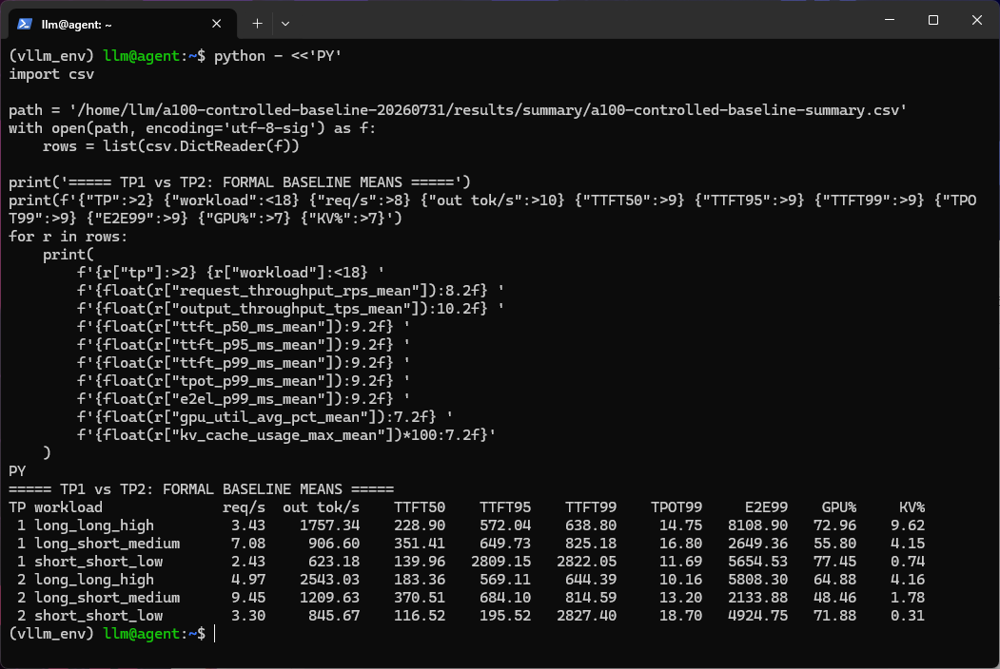
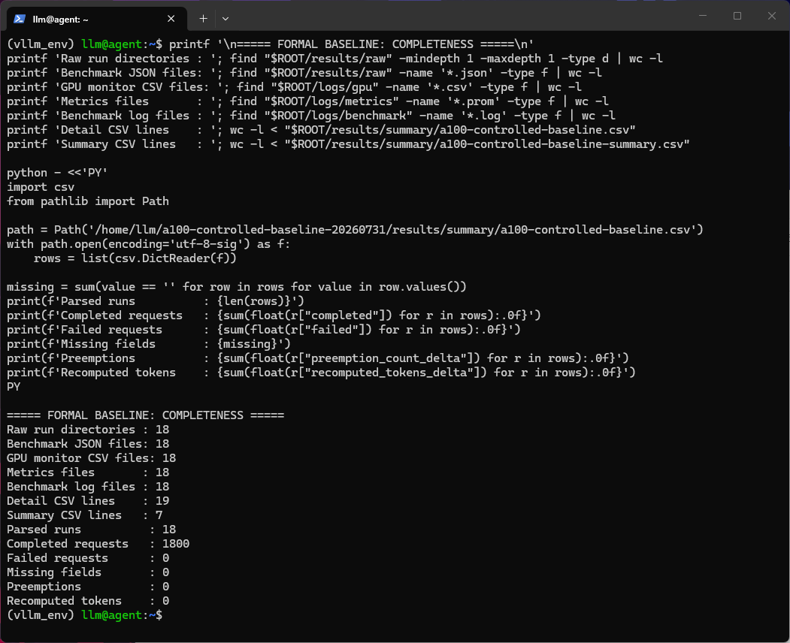
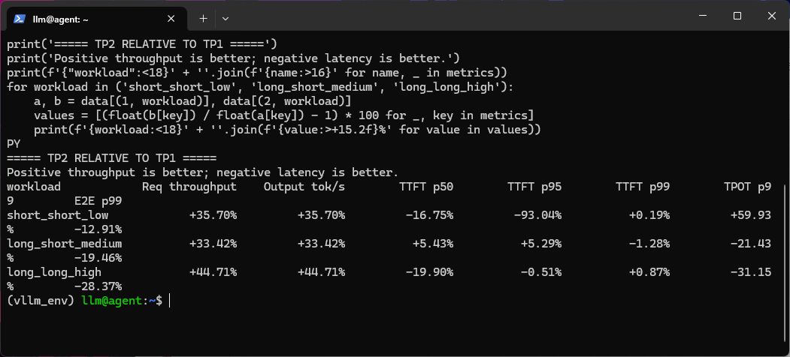
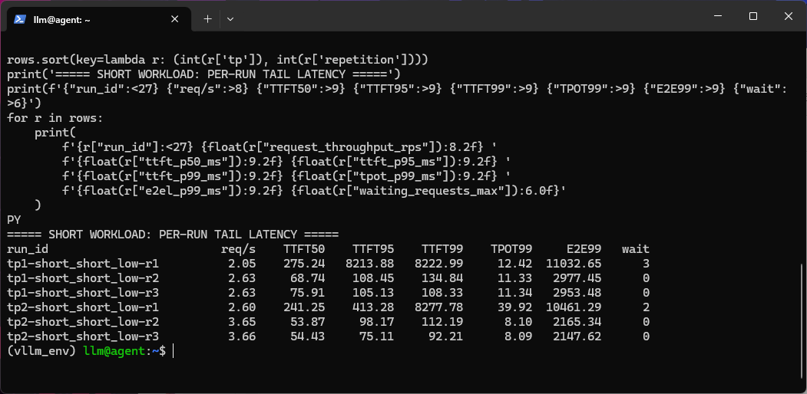

# 双 A100 PCIe 上的 vLLM TP1 vs TP2：18 组受控实验、尾延迟与可追溯基线

> 模型：Qwen2.5-7B-Instruct · GPU：A100 80GB PCIe x2 · vLLM：0.19.0 · 日期：2026 年 7 月

## 一、摘要

在大模型推理部署中，“模型能放进单卡时，还要不要启用张量并行”并没有脱离负载的统一答案。为了把这个问题从经验判断变成可复查的数据，我在两张无 NVLink、跨 NUMA 的 A100 80GB PCIe 上，使用 vLLM 0.19.0 和 Qwen2.5-7B-Instruct，重新建立了一套 TP=1 与 TP=2 正式基线。

实验只保留三类负载：短输入短输出低并发、长输入短输出中并发、长输入长输出高并发。每类负载分别测试 TP1 和 TP2，每组重复 3 次，每次提交 100 个请求，共完成 18 轮、1800 个请求。所有请求均成功，未观测到 Preemption 或 prompt token Recompute。

核心结果如下：

- TP2 在三类负载中的请求吞吐均高于 TP1，提升约 **33.42% 至 44.71%**。
- 长输入、长输出、高并发下，TP2 的吞吐提升 **44.71%**，E2E p99 降低 **28.37%**，TPOT p99 降低 **31.15%**。
- TP2 并非让所有延迟指标都变好：长输入短输出负载的 TTFT p50/p95 分别上升 **5.43%/5.29%**；短负载的 TPOT p99 上升 **59.93%**。
- 短负载第 1 轮在 TP1 和 TP2 中都出现约 8 秒级 TTFT p99，后两轮恢复到约 92 至 135 ms。固定执行顺序可能引入了首轮位置效应，但当前证据不足以判定根因。

因此，本轮更准确的结论不是“双卡全面更快”，而是：**在这套硬件、软件和合成负载下，TP2 用两张 GPU 换取了更高的绝对吞吐，并在重负载下显著缩短完成时间；但轻负载尾延迟仍需单独审计，资源效率也不能仅凭本轮数据下结论。**

## 二、为什么重新建立正式基线

此前的实验包含 vLLM 0.6.10、不同 KV Cache 精度和不同测试方案，适合探索方向，却不适合直接回答 TP1 与 TP2 的正式比较问题。如果把不同框架版本、模型 revision、精度、上下文长度和压测入口的数据放进同一张表，配置差异很容易被误认为 TP 带来的差异。

这次重建基线遵循三个原则：

1. **只改变 TP**：模型、精度、最大上下文、显存比例、seed 和 benchmark 工具保持一致。
2. **保留重复和原始数据**：每个配置重复三次，不挑最好的一轮；每轮保留 JSON、GPU CSV、Prometheus Metrics、服务日志片段和元数据。
3. **同时看吞吐和尾延迟**：除平均吞吐外，显式采集 TTFT、TPOT、E2E 的 p50/p95/p99，避免平均值掩盖尾部异常。

本轮不包含 FP8 KV Cache，也不把 vLLM 0.6.10 的历史结果合并进正式数据表。

## 三、硬件拓扑与冻结环境

### 3.1 硬件拓扑

服务器配有两张 NVIDIA A100 80GB PCIe，驱动版本为 580.173.02。`nvidia-smi topo -m` 显示 GPU0 与 GPU1 之间为 `SYS`：通信需要经过 PCIe，并跨越 NUMA 节点的 SMP 互联。GPU0 绑定 CPU 0-27、NUMA 0，GPU1 绑定 CPU 28-55、NUMA 1；两张卡之间没有 NVLink。



这意味着 TP2 每层涉及的跨卡集合通信运行在相对不利的拓扑上。不过，`SYS` 只能说明通信路径，不能仅凭拓扑就量化通信造成了多少性能损失；要分离计算和通信时间，还需要 NCCL benchmark 或 Nsight Systems 等工具。

### 3.2 软件与模型配置

| 项目 | 正式配置 |
|:---|:---|
| 操作系统 | Ubuntu 24.04.4 |
| Python | 3.10.20 |
| vLLM | 0.19.0 |
| PyTorch | 2.10.0+cu128 |
| PyTorch CUDA runtime | 12.8 |
| 模型 | Qwen2.5-7B-Instruct |
| 模型路径 | `$MODEL_PATH`（公开仓库不包含权重） |
| 权重精度 | `float16` |
| KV Cache dtype | `auto` |
| TP / PP | TP=1、2；PP=1 |
| `gpu-memory-utilization` | 0.75 |
| `max-model-len` | 4096 |
| seed | 0 |
| 服务模型名 | `qwen25-7b-formal` |

这里把截图中的 PyTorch CUDA runtime 记为 12.8。若系统中另装了 CUDA Toolkit，`nvcc` 版本可能不同；二者不是同一个版本口径，不能混写。

## 四、实验设计与指标

### 4.1 三类负载

| 负载 | 输入 tokens | 输出 tokens | 最大并发 | 请求数 | 研究目的 |
|:---|---:|---:|---:|---:|:---|
| `short_short_low` | 512 | 256 | 8 | 100 | 观察轻负载下的 TP 开销与尾延迟 |
| `long_short_medium` | 2048 | 128 | 16 | 100 | 观察 Prefill 占比较高时的表现 |
| `long_long_high` | 2048 | 512 | 32 | 100 | 观察 Decode、吞吐和端到端完成时间 |

每类负载分别运行 TP1、TP2，各重复 3 次：

```text
2 个 TP 配置 x 3 类负载 x 3 次重复 = 18 次正式实验
```

需要注意，8、16、32 是 `--max-concurrency`，不是固定请求到达率。benchmark 将请求尽快提交，并限制最大在途请求数；因此本文不会把它们写成 8/16/32 RPS。

### 4.2 指标定义

- **Request throughput**：完成请求数除以实验持续时间，单位 req/s，越高越好。
- **Input throughput**：总输入 token 除以实验持续时间，单位 tok/s，越高越好。
- **Output throughput**：总输出 token 除以实验持续时间，单位 tok/s，越高越好。
- **TTFT**：Time to First Token，首 token 延迟，单位 ms，越低越好。
- **TPOT**：Time per Output Token，输出 token 的平均生成间隔，单位 ms，越低越好。
- **E2E**：单请求端到端延迟，单位 ms，越低越好。
- **KV Cache usage**：vLLM cache pool 的使用比例，来自 `/metrics`，不同于 `nvidia-smi` 中的预分配显存。

表中的 p50/p95/p99 是每轮 100 个请求内的分位数；六组汇总值再对三轮对应分位数取算术平均。它们不是把三轮 300 个请求合并后重新计算的总体分位数。

## 五、自动化实验链路

### 5.1 启动固定配置的 TP1/TP2 服务

`02-run-baseline.sh` 先验证 Python、vLLM 版本、模型文件、端口状态和 benchmark CLI 参数，再根据 TP 选择可见 GPU。TP1 只使用 GPU0，TP2 使用 GPU0 和 GPU1。

```bash
if [[ "$tp" == "1" ]]; then
  export CUDA_VISIBLE_DEVICES=0
else
  export CUDA_VISIBLE_DEVICES=0,1
fi

vllm serve "$MODEL" \
  --served-model-name "$SERVED_MODEL_NAME" \
  --host 127.0.0.1 \
  --port "$PORT" \
  --tensor-parallel-size "$tp" \
  --pipeline-parallel-size 1 \
  --dtype float16 \
  --kv-cache-dtype auto \
  --gpu-memory-utilization "$GPU_MEMORY_UTILIZATION" \
  --max-model-len "$MAX_MODEL_LEN" \
  --seed "$SEED"
```

服务启动后，脚本依次检查 `/health`、保存 `/v1/models` 和启动时 `/metrics`，然后发送 20 次固定请求进行预热。这样可以排除“服务根本未就绪”这类明显干扰，但后面的短负载数据也表明，20 次小请求预热不一定消除了所有首轮位置效应。

### 5.2 同步采集 GPU 和 vLLM Metrics

每轮 benchmark 期间，后台监控每秒采集一次 GPU 状态和 vLLM Metrics：

```bash
while true; do
  nvidia-smi \
    --query-gpu=timestamp,index,uuid,name,memory.used,memory.total,\
utilization.gpu,power.draw,temperature.gpu \
    --format=csv,noheader >> "$gpu_file" 2>/dev/null || true

  {
    echo "# SCRAPE $(date --iso-8601=seconds)"
    curl -fsS --max-time 2 \
      "http://127.0.0.1:${PORT}/metrics" 2>/dev/null || true
  } >> "$metrics_file"
  sleep 1
done
```

GPU CSV 用于统计参与计算设备的平均/最大利用率和显存峰值；Prometheus Metrics 用于统计 KV Cache、Running Requests、Waiting Requests、Preemption 和 Recompute。

### 5.3 单轮 benchmark 与原始证据留存

```bash
vllm bench serve \
  --backend openai \
  --base-url "http://127.0.0.1:${PORT}" \
  --model "$SERVED_MODEL_NAME" \
  --tokenizer "$MODEL" \
  --dataset-name random \
  --random-input-len "$input_len" \
  --random-output-len "$output_len" \
  --num-prompts "$NUM_PROMPTS" \
  --max-concurrency "$concurrency" \
  --seed "$SEED" \
  --percentile-metrics ttft,tpot,e2el \
  --metric-percentiles 50,95,99 \
  --save-result \
  --result-dir "$raw_dir"
```

每轮保存以下内容：

- benchmark 原始 JSON 与终端日志；
- benchmark 前后的 `/metrics` 快照；
- 实验期间每秒采集的 GPU CSV 和 Metrics；
- 本轮对应的服务日志片段；
- TP、负载、并发、重复编号和退出状态等元数据。

这种组织方式让汇总表中的每一行都能追溯到单轮原始结果。

## 六、汇总器与数据口径修正

### 6.1 正确解析 GPU CSV

`nvidia-smi` CSV 中的数值包含 `%`、`MiB` 等单位，不能直接传给 `float()`。汇总器先通过正则提取数值，再识别当前配置中的活跃设备：

```python
def numeric(value):
    match = re.search(r"-?\d+(?:\.\d+)?", str(value))
    return float(match.group()) if match else None

active_devices = {
    index for index, values in by_device.items()
    if max(memory for memory, _ in values) >= 0.05 * 81920
    or max(util for _, util in values) >= 5.0
}

active_utils = [
    util for index, memory, util in samples
    if index in active_devices
]
```

TP1 的 GPU1 处于空闲状态，因此不纳入 TP1 平均利用率，否则单卡利用率会被人为除以约 2；显存峰值则仍从采样设备中取最大值。

### 6.2 只读取真正的 Prometheus counter

早期异常扫描会匹配到 `# HELP`、`# TYPE` 和 `_created` 时间戳，这些文本不能证明发生过 Preemption。正式解析器忽略注释和 `_created`，并用实验前后的 counter 做差：

```python
def counter_delta(before_path, after_path, metric_name):
    before = metric_last(before_path, [metric_name])
    after = metric_last(after_path, [metric_name])
    if before is None or after is None:
        return ""
    return max(0.0, after - before)

preempt_delta = counter_delta(
    before_prom, after_prom, "vllm:num_preemptions_total"
)
recompute_delta = counter_delta(
    before_prom, after_prom,
    "vllm:prompt_tokens_recomputed_total"
)
```

本轮 18 次实验的两个 counter 增量均为 0。

### 6.3 输入吞吐是派生指标

vLLM 0.19.0 的 benchmark JSON 包含 `total_input_tokens` 和 `duration`，但没有本汇总器原先假设的 `input_throughput` 字段。因此正式口径为：

```python
input_throughput = total_input_tokens / duration
```

本文把它明确标记为由原始 JSON 派生的指标，而不是 vLLM 原生字段。其余吞吐和延迟指标直接读取 benchmark JSON。

### 6.4 三次重复聚合

汇总器按 `(tp, workload)` 分组，对每项指标输出均值、最小值、最大值和样本标准差：

```python
for (tp, workload), group in sorted(groups.items()):
    record = {"tp": tp, "workload": workload, "runs": len(group)}
    for metric in metric_names:
        values = [
            float(row[metric]) for row in group
            if row[metric] not in ("", None)
        ]
        record[f"{metric}_mean"] = statistics.fmean(values)
        record[f"{metric}_min"] = min(values)
        record[f"{metric}_max"] = max(values)
        record[f"{metric}_std"] = statistics.stdev(values)
```

脚本要求恰好存在 18 条实验记录，并检查所有必需 benchmark 字段。字段映射修正后，最终结果为 `missing=0`。

## 七、数据完整性验收

正式实验最终保留：

| 项目 | 数量 |
|:---|---:|
| 原始实验目录 | 18 |
| benchmark JSON | 18 |
| GPU 监控 CSV | 18 |
| Metrics 文件 | 18 |
| benchmark 日志 | 18 |
| 明细 CSV | 19 行（表头 + 18 轮） |
| 汇总 CSV | 7 行（表头 + 6 组） |
| 完成请求 | 1800 |
| 失败请求 | 0 |
| 缺失字段 | 0 |
| Preemption | 0 |
| Recomputed tokens | 0 |



每组的三轮结果全部保留，没有只选择最好的一次。相同 seed 固定了随机请求分布，使三轮差异主要反映运行波动；与此同时，相同 seed 也意味着本轮没有覆盖不同随机输入分布，属于实验边界之一。

## 八、六组正式结果

下表中的数值均为三次重复的算术平均。

| TP | 负载 | 请求吞吐 req/s | 输入吞吐 tok/s | 输出吞吐 tok/s | TTFT p50 ms | TTFT p95 ms | TTFT p99 ms | TPOT p99 ms | E2E p99 ms | GPU 平均利用率 | KV Cache 峰值 |
|---:|:---|---:|---:|---:|---:|---:|---:|---:|---:|---:|---:|
| 1 | 短输入、短输出、低并发 | 2.43 | 1246.37 | 623.18 | 139.96 | 2809.15 | 2822.05 | 11.69 | 5654.53 | 77.45% | 0.74% |
| 2 | 短输入、短输出、低并发 | 3.30 | 1691.34 | 845.67 | 116.52 | 195.52 | 2827.40 | 18.70 | 4924.75 | 71.88% | 0.31% |
| 1 | 长输入、短输出、中并发 | 7.08 | 14505.66 | 906.60 | 351.41 | 649.73 | 825.18 | 16.80 | 2649.36 | 55.80% | 4.15% |
| 2 | 长输入、短输出、中并发 | 9.45 | 19354.04 | 1209.63 | 370.51 | 684.10 | 814.59 | 13.20 | 2133.88 | 48.46% | 1.78% |
| 1 | 长输入、长输出、高并发 | 3.43 | 7029.37 | 1757.34 | 228.90 | 572.04 | 638.80 | 14.75 | 8108.90 | 72.96% | 9.62% |
| 2 | 长输入、长输出、高并发 | 4.97 | 10172.13 | 2543.03 | 183.36 | 569.11 | 644.39 | 10.16 | 5808.30 | 64.88% | 4.16% |


请求吞吐和输出吞吐的相对变化相同，是因为同一负载中的每个成功请求固定生成相同数量的输出 token；不能把这两项当作完全独立的两份加速证据。

## 九、TP2 相对 TP1 的变化

| 负载 | 请求吞吐 | 输出吞吐 | TTFT p50 | TTFT p95 | TTFT p99 | TPOT p99 | E2E p99 |
|:---|---:|---:|---:|---:|---:|---:|---:|
| 短输入、短输出、低并发 | +35.70% | +35.70% | -16.75% | -93.04% | +0.19% | +59.93% | -12.91% |
| 长输入、短输出、中并发 | +33.42% | +33.42% | +5.43% | +5.29% | -1.28% | -21.43% | -19.46% |
| 长输入、长输出、高并发 | +44.71% | +44.71% | -19.90% | -0.51% | +0.87% | -31.15% | -28.37% |



表中吞吐正值代表 TP2 更高；延迟负值代表 TP2 更低、更好。延迟正值不是“提升”，而是退化。

### 9.1 短输入、短输出、低并发

从三轮平均值看，TP2 的请求吞吐由 2.43 req/s 提升至 3.30 req/s，增幅 35.70%；E2E p99 由 5654.53 ms 降至 4924.75 ms，下降 12.91%。TTFT p50 和 p95 也分别下降 16.75% 和 93.04%。

但这并不意味着短负载的所有延迟都改善。TP2 的 TTFT p99 为 2827.40 ms，与 TP1 的 2822.05 ms 几乎相同；TPOT p99 则由 11.69 ms 上升到 18.70 ms，退化 59.93%。平均表格中的 p95 和 p99 给出了完全不同的信号，因此必须继续看逐轮数据，而不能只挑一个 percentile 下结论。

### 9.2 长输入、短输出、中并发

TP2 请求吞吐由 7.08 req/s 提升到 9.45 req/s，提升 33.42%；E2E p99 由 2649.36 ms 降至 2133.88 ms，下降 19.46%；TPOT p99 下降 21.43%。

与此同时，TTFT p50 和 p95 分别上升 5.43% 和 5.29%，TTFT p99 仅下降 1.28%。这组结果说明，在长输入短输出负载下，TP2 的主要收益体现为更高整体吞吐和更短完成时间，而不是每个请求都更早拿到首 token。

### 9.3 长输入、长输出、高并发

这是 TP2 收益最明显的一组：请求吞吐从 3.43 req/s 提升至 4.97 req/s，提升 44.71%；TPOT p99 从 14.75 ms 降至 10.16 ms，下降 31.15%；E2E p99 从 8108.90 ms 降至 5808.30 ms，下降 28.37%。

TTFT p50 下降 19.90%，TTFT p95 基本持平，TTFT p99 则轻微上升 0.87%。因此，即便重负载的总体收益最明确，也仍不能写成“所有尾延迟全面下降”。更准确的描述是：TP2 在长输出高并发下显著提高 Decode 吞吐并缩短请求完成时间，同时 TTFT 极端尾部基本持平。

## 十、短负载尾延迟审计

短负载三次重复的明细如下：

| Run | 请求吞吐 req/s | TTFT p50 ms | TTFT p95 ms | TTFT p99 ms | TPOT p99 ms | E2E p99 ms | Waiting 峰值 |
|:---|---:|---:|---:|---:|---:|---:|---:|
| `tp1-short_short_low-r1` | 2.05 | 275.24 | 8213.88 | 8222.99 | 12.42 | 11032.65 | 3 |
| `tp1-short_short_low-r2` | 2.63 | 68.74 | 108.45 | 134.84 | 11.33 | 2977.45 | 0 |
| `tp1-short_short_low-r3` | 2.63 | 75.91 | 105.13 | 108.33 | 11.34 | 2953.48 | 0 |
| `tp2-short_short_low-r1` | 2.60 | 241.25 | 413.28 | 8277.78 | 39.92 | 10461.29 | 2 |
| `tp2-short_short_low-r2` | 3.65 | 53.87 | 98.17 | 112.19 | 8.10 | 2165.34 | 0 |
| `tp2-short_short_low-r3` | 3.66 | 54.43 | 75.11 | 92.21 | 8.09 | 2147.62 | 0 |



异常集中在两种 TP 配置的第 1 轮：

- TP1 r1 的 TTFT p95/p99 达到 8213.88/8222.99 ms，并出现 Waiting 峰值 3。
- TP2 r1 的 TTFT p99 达到 8277.78 ms、TPOT p99 达到 39.92 ms，并出现 Waiting 峰值 2。
- 两种配置的第 2、3 轮 Waiting 均为 0，TTFT p99 回落到 92.21 至 134.84 ms。

这解释了为什么三轮平均后的 TTFT p95 与 p99 看起来不协调：TP1 r1 的异常已经进入 p95，而 TP2 r1 的异常主要集中在更极端的尾部，所以 TP2 平均 p95 很低，平均 p99 却仍在 2.8 秒左右。

当前实验顺序固定为每个 TP 启动并预热后，依次运行短短低、长短中、长长高，并重复三轮。因此两种 TP 的短负载 r1 都恰好是服务预热后的第一轮正式 benchmark。**首轮位置效应、尚未覆盖的冷态行为或短时排队是合理的待验证方向，但现有日志不能区分这些原因。** 不能直接把异常归因于 NCCL、Python GC、调度器或 NUMA。

下一轮应随机化或平衡负载顺序，并增加重复次数；还可以把每个 TP 的第一轮作为独立 warm-up 丢弃后再开始正式计数。不过，在本篇正式结果中不能事后删除 r1，因为实验协议规定保留全部三轮。

## 十一、GPU、显存与 KV Cache 应如何解读

### 11.1 GPU 利用率不是资源效率结论

三类负载中，TP2 的参与设备平均 GPU 利用率都低于 TP1，但绝对吞吐更高。这可能与两张卡分担计算、采样粒度、benchmark 持续时间以及通信等待有关。不过，没有 kernel timeline 或通信 trace 时，不能把利用率差异直接归因于某一个原因。

更重要的是，TP2 使用两张 GPU，却只得到约 33% 至 45% 的吞吐提升。因此本轮能证明的是“TP2 绝对吞吐更高”，不能证明“TP2 单位 GPU 效率更高”或“成本更优”。后续应增加每 GPU 吞吐、功耗和成本口径。

### 11.2 `nvidia-smi` 显存不等于 KV Cache 压力

TP1 的显存峰值约为 61859 MiB，TP2 单卡峰值约为 62281 MiB。这主要反映 vLLM 根据 `gpu-memory-utilization=0.75` 进行的预分配，不能把这 60 多 GiB 直接写成“实际使用的 KV Cache”。

真正的 KV Cache pool 峰值来自 `/metrics`：

- TP1：约 0.74%、4.15%、9.62%；
- TP2：约 0.31%、1.78%、4.16%。

即使最重负载也没有把 KV Cache 推入高压力区，并且所有实验的 Preemption 和 Recompute 均为 0。因此，本轮不能回答“KV Cache 接近满载时 TP2 是否更好”，只能建立正常压力下的基础吞吐与延迟基线。

## 十二、与旧实验的关系

旧实验使用 vLLM 0.6.10，并混合了 FP16、FP8 KV Cache 和不同测试方式；本轮使用 vLLM 0.19.0、`float16` 权重和 `auto` KV Cache，且采用新的 `vllm bench serve` 入口与三类负载矩阵。

因此，两轮结果只能用于比较实验方法如何演进，不能直接合表或把差异归因于 TP。尤其需要避免以下误读：

- 本轮没有 FP8 KV Cache 实验，不能复用旧文的 FP8 性能结论。
- FP8 KV Cache 压缩的是 KV Cache 存储，并不能据此声称它直接缩小 TP 的激活 all-reduce 数据量。
- 旧文中的固定 RPS 描述不能套用到本轮 `max-concurrency` 测试。
- 不同 vLLM 版本可能改变调度器、kernel、指标字段和 benchmark 行为，版本差异本身就是变量。

## 十三、结论

在双 A100 80GB PCIe、无 NVLink、跨 NUMA、Qwen2.5-7B-Instruct、vLLM 0.19.0 的正式环境中，本轮 18 次受控实验得到以下结论：

1. **TP2 在三类合成负载中都提高了绝对吞吐。** 请求吞吐提升约 33.42% 至 44.71%，但远未达到使用两张 GPU 所对应的 2 倍资源增长。
2. **TP2 的收益在长输出高并发下最明确。** 该负载中 TPOT p99 下降 31.15%，E2E p99 下降 28.37%，说明 Decode 和完成时间获得了实质改善。
3. **吞吐、TTFT、TPOT 与 E2E 必须分开看。** 长输入短输出中，吞吐和 E2E 改善的同时 TTFT p50/p95 略有退化；重负载 TTFT p99 也基本持平。
4. **短负载均值受到首轮极端尾部样本影响。** TP1/TP2 的 r1 都出现约 8 秒级 TTFT p99，而后两轮恢复正常。当前只能确认现象，不能确认根因。
5. **本轮不是 KV Cache 压力测试。** KV Cache 峰值最高约 9.62%，未观测到 Preemption 或 Recompute，不能外推到 cache 接近满载的场景。

部署选择应根据目标区分：如果目标是提高单实例绝对吞吐、缩短重负载请求完成时间，TP2 在本环境中有明确收益；如果模型本就能放进单卡，并且更关心单位 GPU 效率、成本或轻负载尾延迟，则仍需结合真实流量和资源成本继续验证。

## 十四、局限与下一步

本实验仍有以下边界：

- 只测试一个 7B 模型、一个模型 revision 和一套服务器拓扑；
- 使用随机合成 token，不能等同于真实对话、RAG 或生产流量；
- 每组只有三次重复，且三次使用相同 seed；
- 负载执行顺序固定，没有随机化，首轮位置效应与负载效应存在混杂；
- GPU/Metrics 每秒采样，无法观察 kernel 级和单请求级瞬态；
- 没有测量 NCCL 通信时间、功耗、成本和单位 GPU 吞吐；
- KV Cache 使用率较低，没有覆盖饱和、抢占和重计算区间。

下一步计划：

1. 把 KV Cache 峰值逐步推到约 50%、70%、85%，观察 Waiting、Preemption、Recompute 和尾延迟拐点。
2. 对短负载增加重复次数，随机化/平衡执行顺序，并保存逐请求延迟，验证 r1 异常是否稳定复现。
3. 使用 `nccl-tests` 和 Nsight Systems 分离计算、通信与等待时间，量化 `SYS` 拓扑的实际影响。
4. 在正式主基线之外单独做 FP8 KV Cache 消融，不与当前结果混合。
5. 增加每 GPU 吞吐、功耗和成本指标，区分绝对性能与资源效率。

## 附录 A：结果文件

```text
results/a100-controlled-baseline-20260731/
├── config/
│   ├── formal-baseline.env
│   └── workloads.csv
├── results/
│   ├── raw/                              # 18 轮原始结果
│   └── summary/
│       ├── a100-controlled-baseline.csv # 18 轮明细
│       └── a100-controlled-baseline-summary.csv
├── logs/
│   ├── benchmark/
│   ├── gpu/
│   ├── metrics/
│   └── service/
└── environment/
```

## 附录 B：自动化脚本

- `02-run-baseline.sh`：冻结参数、启动服务、预热、运行 18 次 benchmark，并同步采集证据。
- `03-summarize-baseline.py`：解析 JSON、GPU CSV 和 Prometheus Metrics，生成明细与汇总 CSV。
- `04-export-blog-materials.py`：从正式 CSV 生成博客数据报告和相对变化表。

---

*本文结论仅适用于上述硬件、模型、vLLM 版本、参数和合成负载。原始明细、汇总表、监控数据与脚本均保留，可从每项结论追溯到对应实验。*
