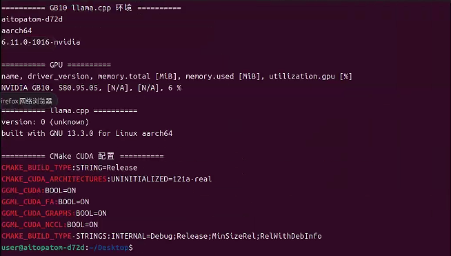
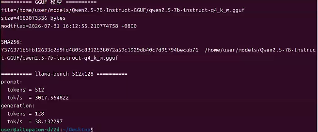
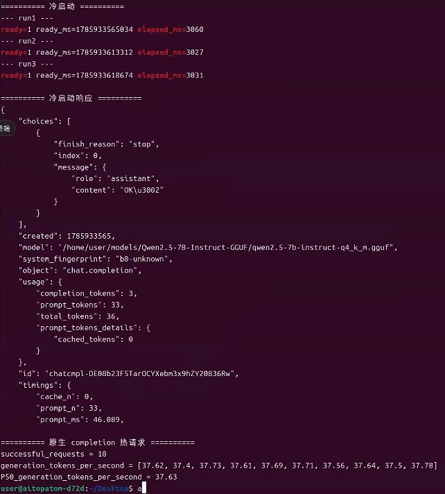
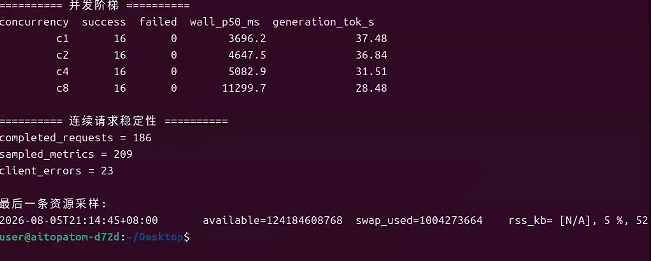

# GB10 上 llama.cpp 独立部署验证

## 1. 问题与边界

本专题整理已经完成的 `llama.cpp` 部署实验：在 NVIDIA DGX Spark 的 GB10 ARM64 平台上，使用 CUDA backend 运行固定的 Qwen2.5-7B-Instruct `GGUF Q4_K_M` 模型，并验证从编译、加载到 HTTP completion 服务的完整基础链路。

它是主项目的异构硬件部署扩展，不替代双 A100 上 `vLLM` 的 TP1/TP2 正式基线。硬件、模型、权重格式、服务框架和负载均不同，不能据此制作跨平台性能排行榜，也不能计算与 A100 主线之间的加速倍数。

本专题回答四个已经完成的问题：

1. CUDA 版 `llama.cpp` 能否在 GB10 ARM64 上编译并运行。
2. 固定 GGUF 模型的冷启动、热请求和基础生成速度处于什么范围。
3. 并发从 1 提高到 8 时，请求成功率和单请求时延如何变化。
4. 在约 20 分钟连续请求中，是否观察到客户端错误、服务异常退出或明显内存漂移。

## 2. 环境与模型身份

| 项目 | 本次记录 |
| --- | --- |
| 设备 | NVIDIA DGX Spark，GB10 |
| CPU 架构 | ARM64 / aarch64 |
| 系统 | NVIDIA DGX Spark Version 7.2.3 |
| 驱动 | 580.95.05 |
| CUDA | 13 |
| Compute Capability | 12.1 |
| 编译架构 | `121a-real` |
| CUDA backend | `GGML_CUDA=ON` |
| 额外编译能力 | Flash Attention、CUDA Graphs、NCCL |
| 模型 | Qwen2.5-7B-Instruct |
| 权重格式 | GGUF `Q4_K_M` |

模型文件 SHA256 为：

```text
7376371b5fb12633c2d9fd4805c8312538072a59c1929db40c7d95794becab76
```

编译时还启用了 Flash Attention、CUDA Graphs 和 NCCL。二进制输出的版本为 `0 (unknown)`，因为当时源码目录不是 Git checkout，未能取得源码 commit 或 release tag。这不影响本次结果的真实性，但意味着严格复现仍缺少源码版本身份。



## 3. 方法与证据来源

服务使用 `llama.cpp` 原生 `/completion` 接口。测试按“启动服务、等待 API ready、发送请求、保存结果、停止服务”的顺序进行；每类测试结束后确认服务进程退出，避免残留进程或端口占用影响下一轮。

证据来自已完成的 GB10 实验过程记录、环境说明及四张原始终端截图。本项目仅复制适合公开展示的截图和脱敏后的结论，不迁入模型文件、服务器绝对路径、访问方式、原始日志或环境目录。

## 4. 已完成结果

### 4.1 基础 prompt 与生成测速

固定生成长度为 128 token 时，记录到以下结果：

| 输入长度 | 输出长度 | Prompt 处理速度 | Generation 速度 |
| ---: | ---: | ---: | ---: |
| 512 token | 128 token | 约 3017.56 tok/s | 约 38.13 tok/s |
| 2048 token | 128 token | 约 2997.80 tok/s | 约 37.98 tok/s |

在这两组固定配置中，Prompt 处理速度约为 3000 tok/s，逐 token 生成速度约为 38 tok/s。两者对应不同推理阶段，不能混成同一指标，也不能直接外推到其他模型、量化格式或上下文长度。



### 4.2 冷启动与热请求

冷启动从服务进程启动开始计时，到 API ready 为止。三次均成功：

| 次数 | API ready 时间 |
| ---: | ---: |
| 1 | 3027 ms |
| 2 | 3031 ms |
| 3 | 3060 ms |

冷启动 P50 约为 `3031 ms`。该时间覆盖进程启动、模型加载和运行时初始化，不能写成纯粹的首 token 延迟。

模型 ready 后，原生 `/completion` 热请求共完成 `10/10`，每次实际生成 128 token，generation P50 约为 `37.62 tok/s`。它与基础测速的 generation 速度接近，说明本轮固定负载下，服务 ready 后的单请求解码路径表现稳定。



### 4.3 并发阶梯

每个并发点固定提交 16 个请求：

| 并发 | 成功/失败 | 请求耗时 P50 | 单请求 generation 均值 |
| ---: | ---: | ---: | ---: |
| 1 | 16/0 | 3696.5 ms | 37.48 tok/s |
| 2 | 16/0 | 4648.9 ms | 36.84 tok/s |
| 4 | 16/0 | 5338.7 ms | 31.51 tok/s |
| 8 | 16/0 | 11299.8 ms | 28.48 tok/s |

所有并发点均没有请求失败，但并发由 1 增至 8 后，请求耗时 P50 增至约 11.30 秒，单请求 generation 均值从 37.48 tok/s 降至 28.48 tok/s。结果说明当前服务可以完成该批请求，但排队和计算资源共享会明显放大单请求时延；不能把单请求 generation 速度简单乘以并发数来推导总吞吐。



### 4.4 连续请求验证

已完成一次约 20 分钟的连续请求实测。记录显示客户端错误数为 `0`，服务未发生异常退出，末尾资源采样未观察到明显内存漂移。该结论仅覆盖本次固定模型、服务配置和请求负载；它是一次短时连续运行观察，不是 24 小时稳定性测试，也不构成生产级长期可用性认证。

## 5. 与主项目的关系

双 A100 主线回答的是固定 Qwen2.5-7B-Instruct、vLLM 0.19.0 和正式受控负载下 TP1/TP2 的吞吐与尾延迟差异。GB10 专题回答的是另一条问题：在 ARM64 小型一体化平台上，`llama.cpp + GGUF Q4_K_M` 是否有可审计的独立部署与基础并发能力。

因此，适合并列呈现的是部署路径、模型身份、工作负载、指标口径和各自边界；不适合并列排名的是 tok/s 数值。读者比较前必须先确认模型、格式、输入输出长度、并发、框架和统计口径一致。

## 6. 可以与不能推出的结论

可以得出：

- CUDA 版 `llama.cpp` 已在 GB10 ARM64 上完成编译、加载和 HTTP completion 服务验证。
- 固定 GGUF `Q4_K_M` 模型的三次冷启动、10 次热请求及并发 1/2/4/8 均已成功完成。
- 并发提升到 8 后，成功率保持，但延迟上升且单请求 generation 速度下降。
- 本次约 20 分钟连续请求未观察到客户端错误或服务异常退出。

不能得出：

- `llama.cpp` 比 vLLM 全面更快，或 GB10 比双 A100 更优。
- GGUF `Q4_K_M` 等同于 NVFP4、AWQ、GPTQ 或 BF16，或这些格式的质量相同。
- 本结果可直接迁移至 DeepSeek 或其他模型。
- 并发 8 请求全部成功等同于高并发性能优秀，或约 20 分钟运行等同于生产长期稳定性。

## 7. 复现资料与剩余缺口

原始已完成资料保留于 `补充任务/DGX spark实验/llama.cpp/`，主项目副本的迁入范围见 [`SOURCE_MANIFEST.md`](../../SOURCE_MANIFEST.md)。公开复现需自行准备同一 GGUF 文件，并以其 SHA256 核验模型身份；所有本地路径应使用 `${MODEL_PATH}`、`${RESULT_DIR}` 等占位符。

尚未补齐的严格复现信息只有 `llama.cpp` 源码 commit 或 release tag。它应被记录为复现缺口，而不是被补写成已完成实验。
