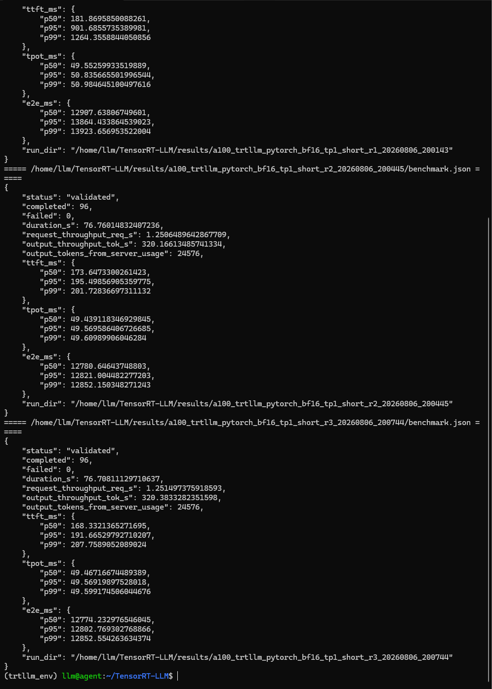
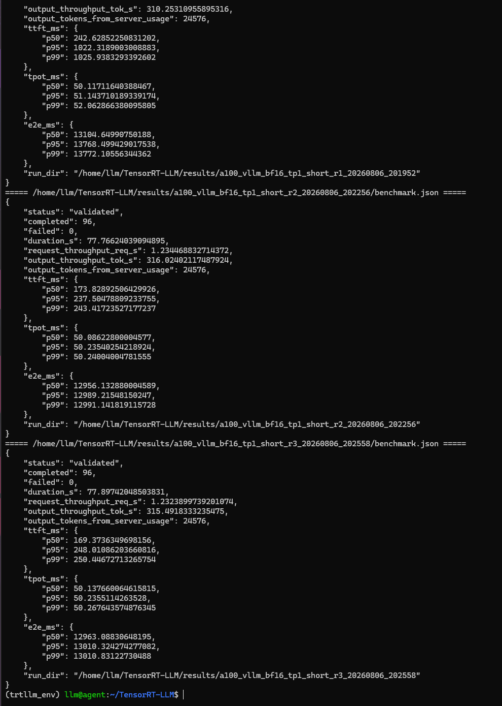

# TensorRT-LLM 从基础部署到 A100 性能验证：Qwen3-32B 的一次可复盘实践

> 本文记录一次范围受控的 TensorRT-LLM 1.2.1 学习与验证：在 A100 单卡上部署 Qwen3-32B BF16，完成服务准入、统一短负载压测，并与 vLLM 做同模型、同精度、同负载的基础参考对照。本次实际执行的是 TensorRT-LLM 1.2.1 的 **PyTorch backend** 路径；传统 serialized TensorRT engine 路径已经完成兼容性排查后停止，不属于 Qwen3-32B 当前官方实验路线。

## 摘要

TensorRT-LLM 是 NVIDIA 面向大语言模型推理的优化框架。版本 1.2.1 将服务接口、模型实现和多种执行方式收在同一框架内：它既提供可以直接加载 Hugging Face 模型的 PyTorch backend，也提供面向 TensorRT engine 的 checkpoint 转换、构建和运行能力。两者不是两个独立产品，而是同一框架下的不同执行路径；对实验结论而言，仍必须标明实际走的是哪一条路径。

本次实验选择 A100 80GB 上的 Qwen3-32B BF16，固定 GPU0、TP=1、输入/输出长度 512/256、闭环并发 16、每轮 96 个请求，分别完成 TensorRT-LLM PyTorch backend 与 vLLM 的三轮测试。六轮均为 `validated`，无失败请求。三轮平均输出吞吐为 317.85 tok/s 与 313.92 tok/s，差异约 1.25%。因此，本次能得出的结论是：**TensorRT-LLM 已完成基础部署和性能验证，在该短负载点与 vLLM 基本持平；不能据此得出 TensorRT engine 更快或框架全面优劣的结论。**

## 1. 为什么要学习 TensorRT-LLM

大模型推理优化不是只把模型启动起来。一个完整的服务链路通常需要处理模型加载、显存规划、KV Cache、动态批处理、并行策略、请求调度、接口兼容和可观测性。vLLM 在通用 Serving 场景中提供了成熟的调度与 OpenAI API 体验；TensorRT-LLM 则更贴近 NVIDIA 的优化部署栈，适合学习 TensorRT plugin、engine 构建、并行推理和硬件相关优化的工程边界。

但“使用 TensorRT-LLM”并不天然等价于“已经跑到了 TensorRT engine”。实际工作中至少要分清模型与服务准入、固定口径下的 backend 性能验证，以及适用于相应模型和版本的 engine 优化闭环。后者是框架的一般能力，不是每个模型在每个版本中都应强行推进的路径。

本实验完成了前两项。对 Qwen3-32B 和 TensorRT-LLM 1.2.1，官方 Qwen3 文档采用直接加载 Hugging Face 权重的 PyTorch backend，并明确不要求 checkpoint 转换或 engine 构建。因此，本项目不把传统 engine 路径当作未完成项，也不把两条路径的结论混在一起。

## 2. TensorRT-LLM 的几个核心概念

### 2.1 TensorRT 与 TensorRT-LLM

TensorRT 是 NVIDIA 的推理优化 SDK，通常通过图优化、算子融合、精度选择和 kernel 选择，将模型编译成特定硬件可执行的推理 engine。TensorRT-LLM 在这一基础上补齐了大语言模型特有的组件，例如注意力 plugin、KV Cache 管理、in-flight batching、多 GPU 并行和 OpenAI 风格服务接口。

TensorRT-LLM 的价值不只在单一 kernel 更快，还在于把模型结构、并行配置、内存管理和请求调度组合成可部署的推理系统。不同模型、GPU、batch、输入输出长度和并行策略下，实际收益都可能不同，因此性能必须在明确口径下测量。

### 2.2 同一 TensorRT-LLM 1.2.1 框架下的两条执行路径

本次最重要的概念关系如下：

| 路径 | 输入 | 主要目的 | 本次状态 |
| --- | --- | --- | --- |
| TensorRT-LLM 1.2.1 的 PyTorch backend 路径 | 原始 Hugging Face 模型目录 | Qwen3 官方的兼容性、服务与基础性能验证路线 | 已完成 |
| 传统 TensorRT engine 路径 | 转换后的 TensorRT-LLM checkpoint | 在适用模型上构建并运行 serialized engine | 已完成兼容性排查后停止，不纳入本项目 |

直接将原始 Hugging Face `config.json` 传给传统 `trtllm-build` 会报 `KeyError: 'architecture'`。原因是该命令需要转换后的 TensorRT-LLM checkpoint，其中包含单数 `architecture` 等 TensorRT-LLM 配置字段；原始 Hugging Face 配置的字段结构不同。后续使用 `QWenConfig.from_hugging_face()` 已能生成 Qwen3 配置，但旧式 converter 在 Qwen3 GQA 的 K 权重映射处触发断言。结合官方 Qwen3 PyTorch backend 文档，本项目停止该非稳定路线：这不等于 Qwen3 不受支持，而是说明传统 engine 链路不形成当前可复现的官方交付路径。

### 2.3 KV Cache、连续批处理与延迟指标

自回归生成时，每生成一个 token 都要访问前文的 Key/Value 状态。KV Cache 将这些状态缓存起来，减少重复计算，但会持续占用显存。在线服务的关键工作是在权重、KV Cache 和请求队列之间分配有限的 GPU 内存。

连续批处理或 in-flight batching 的目标是让不同生成阶段的请求共享 GPU 执行时间。它通常有利于吞吐，但也可能改变首 token 延迟和尾延迟。因此，本次同时记录：

- **TTFT**：请求发出到收到首个 token 的时间。
- **TPOT**：相邻输出 token 的平均间隔，反映解码阶段速度。
- **E2E**：完整请求耗时。
- **输出吞吐**：服务端完成的输出 token 数除以测试时长。

## 3. 实验问题与边界

实验问题不是“哪个框架绝对更快”，而是：

> 在单张 A100、Qwen3-32B BF16、TP=1 和固定短负载下，TensorRT-LLM PyTorch backend 能否稳定服务，并与 vLLM 形成同口径的基础性能参考？

为让结果可解释，固定项如下：

| 项目 | 固定设置 |
| --- | --- |
| 模型 | Qwen3-32B BF16 |
| 硬件 | NVIDIA A100 80GB PCIe，GPU0 |
| 并行 | TP=1 |
| TensorRT-LLM | 1.2.1，PyTorch backend |
| vLLM | 0.19.0 |
| 接口 | OpenAI `/v1/completions`，streaming |
| 输入 / 输出 | 512 / 256 tokens |
| 压测方式 | 闭环并发 16 |
| 正式请求 | 96 请求/轮，3 轮 |
| 热身 | 8 请求 |
| 生成参数 | `temperature=0`，固定 seed `20260806` |

本轮不做回答质量评测、长上下文阶梯、TP=2、多模型比较、GB10 性能，也不做 serialized TensorRT engine 的性能宣称。这样可以让学习目标聚焦在“基础部署是否可行、指标是否可复现”。

## 4. A100 环境与安装排障

实验服务器为双卡 A100，本次只绑定 GPU0。TensorRT-LLM 环境中的关键版本为 TensorRT-LLM 1.2.1、TensorRT 10.14.1.48.post1、PyTorch 2.9.1+cu128 和 Python 3.12.13。

环境、GPU 与软件版本已记录在实验 manifest 和环境文本中；原始终端截图未纳入本公开副本。

安装阶段遇到的主要问题不是模型代码，而是 CUDA 动态库并存。TensorRT-LLM 依赖 CUDA 13 相关库，PyTorch 又使用 CUDA 12 runtime；错误分别表现为找不到 `libcublasLt.so.13`，或 `libc10_cuda.so` 缺少 `cudaGetDriverEntryPointByVersion` 符号。

解决思路是显式管理动态库搜索顺序：让 TensorRT 能找到 CUDA 13 的库，同时保证 PyTorch 优先解析 CUDA 12 runtime。工程上需要避免重复加载激活脚本，否则 `LD_LIBRARY_PATH` 会被不断追加，导致排障结果不可复现。这个问题说明部署框架时，Python 包“安装成功”不等于运行时 ABI 已经正确闭环。

## 5. 从模型加载到服务准入

安装包中存在 `modeling_qwen3.py`，说明当前版本包含 Qwen3 的 PyTorch 模型实现。使用 TensorRT-LLM 的 PyTorch backend 直接加载本地 Hugging Face 权重后，服务能够通过健康检查，并以 `Qwen3-32B` 暴露模型 ID。

服务健康检查与模型 ID 已记录在准入结果中；原始终端截图未纳入本公开副本。

这一阶段还暴露了一个容易被忽略的配置问题：初次用 `max_batch_size=1` 启动时，闭环并发 16 的请求近似串行执行，单轮耗时异常长。服务并没有失效，但该配置不具备本次负载需要的批处理能力。调整为支持批处理的配置后再进入正式压测，避免把服务配置错误误归因为框架性能。

## 6. 统一 benchmark 方法

两端使用同一份 OpenAI streaming benchmark 脚本，主要参数完全一致。每轮保留 `config.json`、`environment.txt`、`gpu.csv`、`requests.json` 和 `benchmark.json`，并将三轮原始结果、日志和汇总 CSV 下载归档。

选择闭环并发而非开环到达率，是因为本次目标是基础服务性能验证。闭环负载能较直接地观察固定并发下的端到端响应和稳定性；它不用于推导某个 SLO 下的最大可承载请求率。

三轮而非单轮的原因同样实际：首轮可能受缓存预热、内存池初始化或后台活动影响。保留全部轮次，才能看到首轮尾延迟波动，而不是只挑选最好的一次结果。

## 7. 逐轮结果：六轮全部完成

下图展示了 TensorRT-LLM 和 vLLM 的三轮原始汇总。六轮均通过校验，每轮完成 96/96 请求、失败数为 0。TensorRT-LLM R1 的 TTFT 尾部较高，R2/R3 明显收敛；vLLM R1 也有较高的 TTFT 尾部。这类首轮波动应被记录，而不是被过度解释为某个框架的固有缺陷。

## 8. 三轮均值对比与解读

| 指标 | TensorRT-LLM PyTorch backend | vLLM | 解读 |
| --- | ---: | ---: | --- |
| 输出吞吐 | 317.85 tok/s | 313.92 tok/s | TensorRT-LLM 高约 1.25% |
| TTFT P50 | 174.62 ms | 195.28 ms | 差异有限，受首轮波动影响 |
| TTFT P95 | 429.62 ms | 502.61 ms | 两端均有首轮尾部抬升 |
| TTFT P99 | 557.95 ms | 506.60 ms | 不支持单方面稳定性结论 |
| TPOT P99 | 50.06 ms | 50.86 ms | 解码阶段基本相当 |
| E2E P99 | 13209.45 ms | 13258.03 ms | 完整请求尾延迟基本相当 |
| 完成情况 | 288/288 | 288/288 | 均无失败 |

从吞吐看，317.85 tok/s 相比 313.92 tok/s 的差异约为 1.25%，远小于能支撑“显著领先”的程度。TPOT P99 只相差 0.80 ms，E2E P99 也几乎相同。更稳妥的表述是：**在这一个短负载点，TensorRT-LLM PyTorch backend 和 vLLM 的基础性能基本持平。**

TTFT 的均值存在首轮影响：TensorRT-LLM R1 的 P99 为 1264.36 ms，vLLM R1 的 P99 为 1025.94 ms，而两端后两轮均回落到约 200 至 250 ms 区间。因此，现有数据足以证明稳定完成请求，但不足以得出“某个框架 TTFT 更稳定”的结论。

## 9. 这次实践学到的工程经验

### 9.1 先证明运行路径，再谈性能

一次有效的框架验证至少应包括包版本、GPU 环境、模型识别、健康检查、最小请求和可保存的 benchmark 结果。任何一环缺失，都容易出现“服务看似启动了，但路径并不正确”的误判。

### 9.2 配置本身可以决定压测形态

`max_batch_size=1` 使并发压测退化为近似串行，是这次最直接的例子。性能实验中的“框架差异”往往混有 batch、KV Cache、最大序列长度、显存比例和生成参数等配置差异。对照实验的第一原则不是参数越多越好，而是将必要条件冻结并写入归档。

### 9.3 结果要区分证据强度

本次的强证据是：Qwen3-32B 能被 TensorRT-LLM PyTorch backend 服务；统一短负载下三轮无失败，并留下逐请求和逐轮原始数据。弱证据是：约 1.25% 的吞吐差距。后者只能作为该负载点的观察，不能延伸为所有模型、所有并发或所有 TensorRT-LLM 路径的结论。

## 10. 当前限制、兼容性结论与后续边界

本项目的范围已完成：TensorRT-LLM 1.2.1 的 Qwen3-32B PyTorch backend 服务准入、基础性能验证和同口径 vLLM 参考对照均已归档。传统 serialized TensorRT engine 路径也已完成必要的兼容性调查，但不继续推进：原始 HF 目录不能直接作为 `trtllm-build` 输入，旧式 Qwen3 converter 又在 GQA 权重映射处断言失败，而当前官方 Qwen3 文档明确采用直接加载 HF 权重的 PyTorch backend。

因此，不修改框架源码、不维护非官方补丁，也不为了这条路径盲目升级到未验证的预发布环境。未来只有在 NVIDIA 发布明确支持 Qwen3 serialized engine 的稳定版本、转换命令和可复现实例时，才值得另立独立实验；它不是本项目的待办，也不会改变本文的 PyTorch backend 性能结论。

## 总结

这次实验完成了一个小而完整的工程闭环：从 Conda native 环境安装、CUDA 动态库排障、Qwen3 模型加载，到 OpenAI 服务准入、三轮统一短负载测试和本地原始数据归档。TensorRT-LLM PyTorch backend 与 vLLM 在 A100 单卡、Qwen3-32B BF16 的固定负载下基本持平，输出吞吐仅有约 1.25% 的差别。

相比追求一个夸张的框架排行榜，这份结果更有价值的部分是边界清楚、数据可回查、结论不过度延伸。传统 engine 路径的排查结果也被如实归档：对于当前 Qwen3-32B 与 1.2.1 组合，遵循官方 PyTorch backend 路线比维护一条非官方转换链路更有工程价值。
