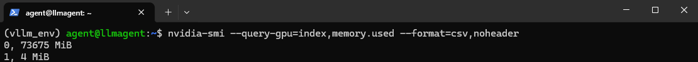
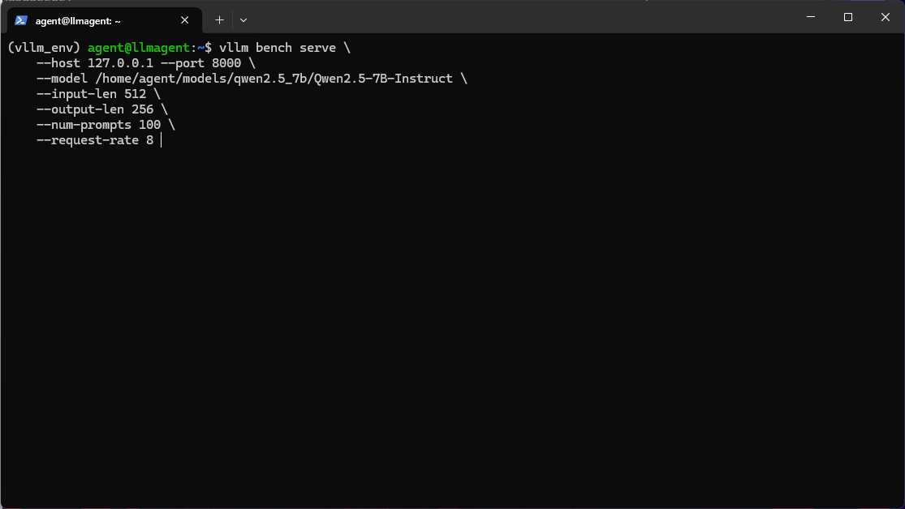
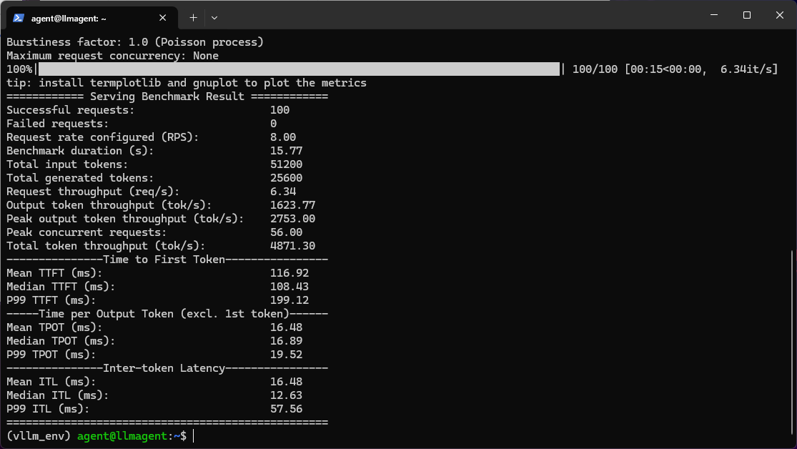
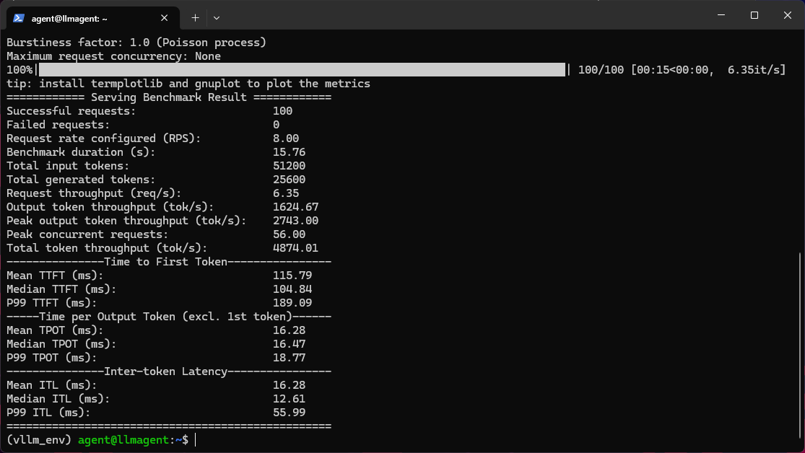
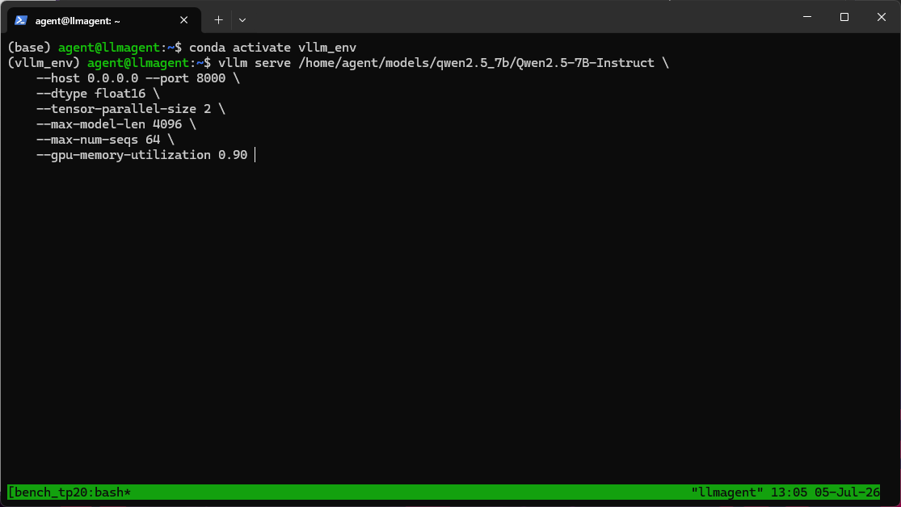
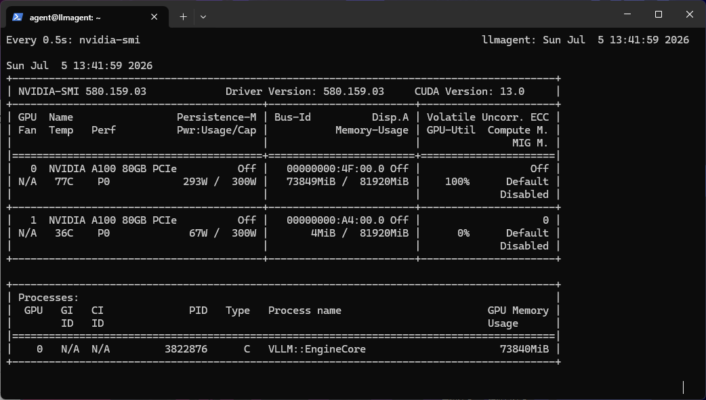

# 实验：单卡/双卡 × FP16/FP8 KV Cache 四种 vLLM 推理配置性能对比

> 模型：Qwen2.5-7B-Instruct · GPU：A100 80GB PCIe ×2 · 推理框架：vLLM 0.6.10

## 一、摘要

在双 A100 80GB PCIe 服务器上部署 Qwen2.5-7B-Instruct 的过程中，我对单卡/双卡、纯 FP16/FP8 KV Cache 四种组合做了一轮系统性的压测，覆盖了短文本低并发和长文本高并发两个典型场景。结果——**短文本低并发时，双卡张量并行（TP2）的吞吐反而不如单卡；长文本高并发下，性能直接翻倍**。双卡一定比单卡快吗？做完这轮测试后，我对这个问题的回答是：看情况。

这篇文章把完整的测试数据、对比分析和踩坑经验全部记录下来，希望能提供一些参考。

## 二、硬件拓扑与环境

### 2.1 硬件配置

| 组件 | 规格 |
|:---|:---|
| GPU | NVIDIA A100 80GB PCIe ×2 |
| GPU 互联 | **无 NVLink**，通过 PCIe Switch 经 CPU（`SYS`）通信 |
| CPU | Intel Xeon |
| 系统内存 | ≥256 GB |

关键一点：这两张 A100 之间**没有 NVLink 桥接**。`nvidia-smi topo -m` 显示两张 GPU 之间的连接类型为 `SYS`，意味着 GPU 间通信必须经过 PCIe 上行到 CPU，再由 CPU 通过 QPI/UPI 转发——单向理论带宽仅约 32 GB/s（PCIe 4.0 x16），与 NVLink 的 600 GB/s 相差近 20 倍。这个差距在后面短文本场景的测试中会被放大得非常明显。

### 2.2 软件环境与配置矩阵

- **推理框架**：vLLM 0.6.10
- **模型**：Qwen2.5-7B-Instruct（FP16 权重约 14GB）
- **四种测试配置**：

| 编号 | 配置 | 启动参数关键项 |
|:---|:---|:---|
| A | 单卡 FP16 | `--tensor-parallel-size 1` |
| B | 单卡 FP16 + FP8 KV Cache | TP1 + `--kv-cache-dtype fp8` |
| C | 双卡 TP2 FP16 | `--tensor-parallel-size 2` |
| D | 双卡 TP2 + FP8 KV Cache | TP2 + `--kv-cache-dtype fp8` |

## 三、测试方案

使用 vLLM 自带的 benchmark 工具，设计两个典型负载场景：

| 场景 | 输入/输出长度 | 请求速率 (RPS) | 模拟场景 |
|:---|:---|:---|:---|
| **短文本低并发** | 512/256 tokens | 8 | 对话、RAG 问答 |
| **长文本高并发** | 2048/512 tokens | 32 | 文档摘要、长上下文推理 |

每个场景采集四个核心指标：**吞吐 (req/s)**、**平均 TTFT (ms)**、**Token 吞吐 (tok/s)**、**GPU 显存峰值 (MiB)**。每个配置每个场景重复多轮，取稳定后的数据。

## 四、性能数据对比

### 4.1 完整压测数据表

| 配置 | 并发速率 | 输入/输出长度 | 吞吐 (req/s) | 平均 TTFT (ms) | Token 吞吐 (tok/s) | GPU0 显存峰值 (MiB) | GPU1 显存峰值 (MiB) |
|:---|:---|:---|:---|:---|:---|:---|:---|
| 单卡 FP16 TP1 | 8 | 512/256 | **6.34** | 116.9 | 4871.3 | 73849 | — |
| 单卡 FP16 TP1 | 32 | 2048/512 | 3.36 | 7861.7 | 8606.6 | 73997 | — |
| 单卡 FP16 + FP8 KV Cache | 8 | 512/256 | **6.35** | 115.8 | 4874.0 | 74312 | — |
| 单卡 FP16 + FP8 KV Cache | 32 | 2048/512 | 3.66 | 7221.8 | 9376.4 | 74572 | — |
| 双卡 TP2 FP16 | 8 | 512/256 | 5.71 | 3892.5 | 4385.1 | 74003 | 74003 |
| 双卡 TP2 FP16 | 32 | 2048/512 | **7.04** | 1895.9 | **18033.8** | 74003 | 74003 |
| 双卡 TP2 FP16 + FP8 KV Cache | 8 | 512/256 | 6.72 | 101.2 | 5159.4 | 74615 | 74615 |
| 双卡 TP2 FP16 + FP8 KV Cache | 32 | 2048/512 | 4.34 | 6347.4 | 11098.7 | 74689 | 74689 |

> 注：TTFT = Time to First Token（首 token 延迟，反映预填充阶段速度）；Token 吞吐 = 总 tokens / 总时间（输入+输出）；显存为测试过程中 `nvidia-smi` 记录的最高 `Memory-Usage`。

### 4.2 短文本低并发：为何双卡反而不如单卡？

短文本场景（512/256, 8 RPS）的数据值得多看两眼：

- 单卡 FP16：**6.34 req/s**，TTFT **116.9 ms**，Token 吞吐 **4871.3 tok/s**
- 双卡 TP2 FP16：5.71 req/s，TTFT 3892.5 ms，Token 吞吐 4385.1 tok/s

**双卡吞吐反而下降约 10%，TTFT 更是暴增 33 倍**。这个结果乍看反直觉，但放到硬件拓扑下就讲得通了。短序列（512 tokens）的预填充计算量很小，在一张 A100 上几十毫秒就能跑完。切到 TP2 后，每一层 Transformer 的中间激活都需要在两张卡之间做 all-reduce 同步，而我们的 GPU 走 `SYS`（PCIe）通道，通信延迟高达数十微秒。短序列下，**通信开销在总耗时中的占比远超计算节省**——GPU 大部分时间不是在算，而是在等对面把数据传过来。并行没有加速，反而变成了排队。

一个有意思的细节：双卡在加上 FP8 KV Cache 后，短文本数据回升到 6.72 req/s、TTFT 101.2 ms。FP8 KV Cache 缩减了每层 all-reduce 的通信数据量，相当于给 `SYS` 的窄带宽减了负，部分弥补了通信瓶颈。

### 4.3 长文本高并发：双卡性能翻倍

切换到长文本场景（2048/512, 32 RPS），局势完全反转：

| 指标 | 单卡 FP16 | 双卡 TP2 FP16 | 提升 |
|:---|:---|:---|:---|
| 吞吐 (req/s) | 3.36 | **7.04** | +109% |
| Token 吞吐 (tok/s) | 8606.6 | **18033.8** | +109% |
| 平均 TTFT (ms) | 7861.7 | **1895.9** | −76% |

长序列（2048 tokens）的预填充阶段包含大量矩阵乘法，计算强度远高于短序列。此时 TP2 的并行计算收益稳稳压过通信开销，**吞吐接近线性翻倍，TTFT 降低 76%**。这个对比很直观地说明了一个规律：张量并行的收益高度依赖单次前向的计算量。序列越长、batch 越大，TP 越划算；反之，轻负载下通信开销可能吃掉全部收益。

做多卡推理调优的时候，一定要把"长/短序列"和"高/低并发"拆开来看，同一个配置在不同场景下的表现可能截然相反。

### 4.4 FP8 KV Cache：真实的收益与局限

FP8 KV Cache 是 vLLM 近期支持的特性，将 KV 缓存以 FP8 精度存储，目标是减少显存占用和通信量。实际表现因场景而异：

- **短文本单卡**：几乎无影响（4871.3 → 4874.0 tok/s），GPU 显存本来就用不完，省了也体现不出来
- **长文本单卡**：+8.9%（8606.6 → 9376.4 tok/s），TTFT 从 7861.7 降至 7221.8 ms，有实打实的改善
- **短文本双卡**：+17.7%（4385.1 → 5159.4 tok/s），通信数据量减少直接缓解了 `SYS` 瓶颈
- **长文本双卡**：**−38.5%**（18033.8 → 11098.7 tok/s）

长文本双卡场景下 FP8 KV Cache 不升反降，这个结果我一开始也不太信，重跑确认后数据是一致的。推测原因是在高并发长序列下，FP8 量化与反量化的额外计算开销跟 TP2 的通信开销叠加，最终拖慢了整体速度。这也说明 FP8 KV Cache 并非万能优化——能不能受益、受益多少，取决于具体场景的负载特征。有条件的话，建议在影子环境用真实流量压一轮再决定是否上线。

## 五、三大踩坑点剖析

### 踩坑 1：无 NVLink 下盲目开 TP2，吞吐不升反降

**现象**：短文本压测时，`--tensor-parallel-size 2` 的吞吐竟然不如 `--tensor-parallel-size 1`。

**根因**：张量并行在每层 Transformer 后都会插入 all-reduce 同步点。A100 PCIe 版走 `SYS`（PCIe + QPI）通信，延迟高、带宽低。当单次前向的计算时间小于通信开销时，GPU 大量时间消耗在等待同步上，并行反而拖后腿。

**解决思路**：
- 模型权重 + KV Cache 总量小于单卡显存（80GB）时，优先单卡推理。别被"多卡就是快"的直觉带偏，拿数据说话
- 必须多卡时，增大 `max-model-len` 或 batch size，让计算时间远大于通信时间
- 有条件的话上 NVLink 桥接或直接选 SXM 版本，从物理链路上解决问题

### 踩坑 2：显存"纹丝不动"——vLLM 预分配机制的假象

**现象**：`nvidia-smi` 显示 GPU 显存始终约 74GB，无论跑短文本还是长文本、低并发还是高并发，显存占用几乎不变。一开始觉得"显存绰绰有余，稳了"，后来才发现事情没那么简单。

**根因**：vLLM 启动时会**一次性预分配** GPU 内存，将绝大部分显存预留给 KV Cache（由 `--gpu-memory-utilization` 和 `--max-model-len` 决定）。后续推理只是在这个预分配池里分配和回收 KV 块，所以从 `nvidia-smi` 看进程级别的显存占用基本不动。

**正确监控方法**：
- 通过 vLLM 的 `/metrics` 端点查看 `vllm:gpu_cache_usage_perc`，获取 KV Cache 池的实际使用率——这才是真正有意义的指标
- 关注 `nvidia-smi` 的 **Memory-Usage 峰值**而非实时值（表中已记录各场景峰值）
- 短文本和长文本的显存峰值差异仅约 150 MiB，对 80GB 显存而言可以忽略，这说明同一配置下不同负载的显存压力差异很小，真正的瓶颈不在显存量上

### 踩坑 3：服务被 Killed，却无 OOM 日志

**现象**：压测过程中 vLLM 进程突然消失，`dmesg` 查不到 OOM killer 记录，也没有 Python traceback。进程像是凭空蒸发了一样。

**排查思路**：

1. **确认是否为系统 OOM**：`dmesg | grep -i "out of memory"` 或 `journalctl -xe | grep oom`。如果 CPU 内存不足，OOM killer 通常会留下记录；若无记录，大概率不是系统层面的问题
2. **确认是否为 CUDA OOM**：vLLM 的 CUDA OOM 一般会抛出 `torch.cuda.OutOfMemoryError` 并退出。检查启动终端的 stderr 输出；如果用了 `nohup`，检查 `nohup.out`
3. **检查 KVCache 配置是否过于激进**：`--max-model-len` 设得过大，配合 `--gpu-memory-utilization` 过高，可能导致首次分配时 CUDA 驱动直接报错退出。由于是驱动层的问题，Python 来不及 catch，所以没有 traceback。建议先用较小的 `--max-model-len` 验证服务能正常启动和运行，再逐步上调

在本次测试中，将 `--gpu-memory-utilization` 从默认值 0.9 调低到 0.85 后问题消失——留 15% 的显存余量给 CUDA context 和临时缓冲区，比默认的 10% 更安全。

## 六、生产实践建议

基于以上数据和踩坑经验，总结几条实操建议：

1. **模型小于单卡容量时，优先单卡推理**。Qwen2.5-7B（FP16 约 14GB）加上 KV Cache 在一张 A100 80GB 上完全够用。开 TP 带来的通信开销在轻负载下可能比并行收益更大，不要默认"多卡等于更快"

2. **必须多卡时，用长序列或大 batch 摊薄通信成本**。部署 70B 以上大模型时单卡放不下，TP 是刚需。此时应尽量让每次前向的计算量足够大（长上下文、大并发），通信开销占比自然会降下来

3. **FP8 KV Cache 定位为延迟优化手段，而非省显存工具**。在我们的测试中，由于预分配机制，它的显存节省在监控上体现不出来，但对 TTFT 有 8%~18% 的改善（取决于场景）。不过长文本双卡场景下的负优化也提醒我们——它不是免费午餐，需要实测验证

4. **监控显存要结合 `nvidia-smi` 峰值与 vLLM Metrics**。`nvidia-smi` 的实时值被预分配机制"锁死"了，不能反映真实压力。盯紧 `gpu_cache_usage_perc`，避免 KV Cache 池接近满载时出现隐性排队

5. **压测务必覆盖长/短、高/低并发的组合**。同一配置在短文本场景可能表现最差，在长文本场景却是最优——只测一种场景就下结论，大概率是片面的

## 七、总结与展望

这次压测下来，最大的收获有三点：

1. **GPU 互联拓扑对多卡推理的性能有决定性影响**。PCIe 版 A100 的 `SYS` 连接在做张量并行时通信瓶颈突出，短序列下甚至不如单卡。选型时务必把 GPU 互联方式纳入评估，不能只看显存和算力

2. **vLLM 的显存管理机制值得深入理解**。预分配策略简化了内存管理但也容易造成"显存充裕"的监控错觉。正确解读 `nvidia-smi` 和 vLLM Metrics 是做好奇推理运维的基本功

3. **没有银弹配置，最优参数取决于场景**。FP8 KV Cache 和 TP 并行度的效果高度依赖模型规模、序列长度和并发量。需要通过覆盖多种负载的系统性压测来找到适合自己业务的最优组合

后续计划：

- **大模型测试**：在 Qwen2.5-72B 上验证双卡 TP2 的极限性能。届时单卡无法容纳模型，TP 变成刚需，可以更充分地评估 PCIe 版 A100 在大模型场景下的实际表现
- **量化方案对比**：AWQ/GPTQ INT4 权重量化 vs FP8 KV Cache 量化，两种方案在推理速度和显存占用上的 trade-off 不同，值得并排对比
- **跨架构对比**：如果有机会在 H100/H800（NVLink 4.0）上复现同一套测试，可以量化 NVLink 带宽对 TP 效率的真实提升幅度

---

*测试环境：双 A100 80GB PCIe · vLLM 0.6.10 · Qwen2.5-7B-Instruct · 2026 年 7 月*
