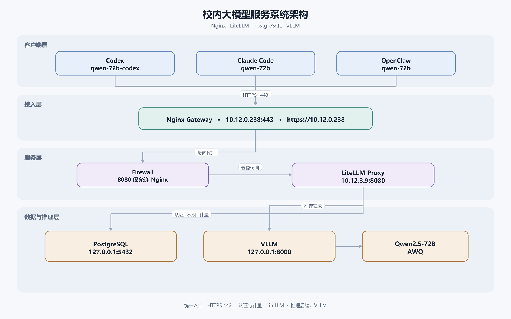

# 内网大模型接入Coding Agent架构：从零搭建企业级LLM推理网关

> 推理引擎：VLLM + Qwen 72B · 网关：LiteLLM + PostgreSQL + Nginx · 客户端：Codex / Claude Code / OpenClaw

## 一、架构总览

### 1.1 设计目标

团队在内网部署了 Qwen 72B 大模型（VLLM 推理引擎）之后，面临一个实际需求：如何让内网用户在自己的电脑上使用 Codex、Claude Code、OpenClaw 等 Coding Agent 工具，安全地接入自建模型？直接暴露 VLLM 的 8000 端口显然不可行——缺乏身份认证、没有用量计量、无法区分不同用户、不支持 Key 管理与撤销。

经过调研和实践，我们搭建了一套完整的 LLM 推理网关架构，实现了以下目标：

- **统一 HTTPS 入口**：所有客户端通过单一 Nginx 443 端口接入，内部 CA 证书保证传输安全
- **API Key 认证与权限隔离**：基于 LiteLLM 虚拟 Key 机制，一人一 Key、不同客户端不同模型权限
- **Token 计量与速率限制**：PostgreSQL 持久化存储每次请求的 Token 消耗，支持 RPM/TPM 限流
- **端口安全边界**：防火墙确保客户端只能访问 Nginx 网关，绝不可直连推理引擎
- **多客户端兼容**：同时支持 Codex（Responses API）、Claude Code（Messages API）和 OpenClaw（Chat Completions API）

### 1.2 架构图



<p align="center"><b>图1：内网大模型接入 Coding Agent 架构拓扑</b></p>

### 1.3 数据流与服务器分工

整个系统由两台服务器组成，数据流严格单向：

```
Codex ──────────┐
Claude Code ────├── HTTPS Nginx:443 ── LiteLLM:8080 ── VLLM:8000 ── Qwen 72B
OpenClaw ───────┘
```

| 角色 | 主机 | 运行的服务 |
|:---|:---|:---|
| 模型服务器 | `<MODEL_SERVER_IP>` | VLLM（推理引擎）、LiteLLM（认证代理）、PostgreSQL（持久化存储） |
| 网关服务器 | `<GATEWAY_SERVER_IP>` | Nginx（HTTPS 反向代理 + SSL 终止） |

**端口规划与安全边界**：

| 主机 | 端口 | 监听范围 | 用途 | 客户端是否可达 |
|:---|:---|:---|:---|:---|
| 模型服务器 | 8000 | `127.0.0.1` 仅本机 | VLLM OpenAI 兼容接口 | 不可达 |
| 模型服务器 | 8080 | `0.0.0.0`，iptables 限制来源 | LiteLLM Proxy | 仅网关服务器可达 |
| 模型服务器 | 5432 | `127.0.0.1` 仅本机 | PostgreSQL | 不可达 |
| 网关服务器 | 443 | 内网 | Nginx HTTPS 统一入口 | 可达（唯一入口） |

核心安全原则：**客户端只能看到网关的 443 端口**，VLLM、LiteLLM、PostgreSQL 三个后端服务对客户端完全透明。

## 二、试错历程：为什么这条路走了四五天

上面的架构看起来很清晰——Nginx 转发、LiteLLM 做协议转换和认证、VLLM 专注推理。但这不是我们一开始就画出来的蓝图，而是在四五天的反复试错中逐步收敛出来的。

当时的起点很简单：VLLM 已经在模型服务器上跑起来了，`curl http://<MODEL_SERVER_IP>:8000/v1/chat/completions` 能正常返回 Qwen 72B 的生成结果。接下来要做的事情听起来也不复杂——让 Codex、Claude Code、OpenClaw 这三款 Coding Agent 工具连上来。

我们没想到的是，**三种客户端使用了三种不同的 API 协议**，而 VLLM 只原生支持其中一种。

### 2.1 OpenClaw 的意外顺利与问题的第一次暴露

第一个装好的客户端是 OpenClaw。配置指向 `http://<MODEL_SERVER_IP>:8000/v1`，几乎开箱即用——Chat Completions 请求发过去，流式输出正常返回，工具调用也工作。花了不到十分钟。

接着配置 Claude Code。在 `settings.json` 里填好 `ANTHROPIC_BASE_URL` 和 `ANTHROPIC_AUTH_TOKEN`，启动，发送一条最简单的消息"hello"。然后得到了第一个报错：

```
400 Bad Request
ContextWindowExceededError: requested 32000 output tokens
```

Claude Code 在每次请求中默认携带 `max_tokens: 32000`。而 Qwen 72B 的上下文窗口是 32768 tokens——如果输入 prompt 超过 768 tokens，`input + max_tokens` 就会超出窗口上限。VLLM 拒绝这个请求，连一条"hello"都不让过。

### 2.2 Flask 补丁时代：头痛医头的失败尝试

第一个想法是写一个 Flask 中间层，放在 Claude Code 和 VLLM 之间，拦截请求、把 `max_tokens` 强制裁剪为 4096，再把剩余参数透传给 VLLM，最后把 VLLM 的 Chat Completions 响应原样返回。

```python
# Flask 中间层的核心逻辑（简化示意）
@app.route('/v1/messages', methods=['POST'])
def proxy_messages():
    body = request.get_json()
    body['max_tokens'] = min(body.get('max_tokens', 4096), 4096)
    resp = requests.post('http://127.0.0.1:8000/v1/chat/completions', json=body)
    # 尝试将 Chat Completions 响应转为 Messages 格式...
    return transformed_response
```

这勉强让 Claude Code 跑通了"hello world"。但第二轮的报错立刻暴露了问题的本质：

```
KeyError: 'content_block'
AttributeError: 'ChatCompletionMessage' object has no attribute 'content_block'
```

Claude Code 期望的响应格式是 Anthropic Messages API——包含 `content_block`、`stop_reason`、`usage.input_tokens` 等字段的嵌套 JSON 结构。而 VLLM 返回的是 OpenAI Chat Completions 格式——`choices[0].message.content` 的扁平结构。两种格式的字段名、嵌套层级、终止原因枚举值完全不同。Flask 中间层要对每一个响应做格式转换——不仅仅是 `content` 字段的搬运，还包括流式 SSE 事件的逐行解析、`message_start`/`content_block_delta`/`message_stop` 等事件类型的构造、工具调用参数在两种格式间的映射。越补越复杂，代码从最初的 20 行膨胀到 300 行，仍然有边角 case 导致客户端崩溃。

**与此同时，Codex 端也在报错。** Codex 使用 OpenAI 的 Responses API——这和 Anthropic Messages API 是两种完全不同的协议。Codex 发送的请求体包含 `input`、`tools`、`tool_choice`、`parallel_tool_calls` 等 Responses API 的专有字段，VLLM 的 Chat Completions 端点直接返回 `400 Bad Request: unknown parameter`。更棘手的是，Codex 的 `namespace` 类型工具调用在当前版本的 VLLM 和 Qwen 模型上根本不支持——这不是中间层能解决的问题。

**到这里，局面是这样的：**

| 客户端 | API 协议 | VLLM 直连 | Flask 补丁 |
|:---|:---|:---|:---|
| OpenClaw | OpenAI Chat Completions | 正常工作 | 不需要 |
| Claude Code | Anthropic Messages | `max_tokens` 超限导致 400 | 基础对话勉强可用，流式/工具调用/响应格式反复报错 |
| Codex | OpenAI Responses | 协议不兼容，400 | `namespace` 工具不支持，协议差异太大无法桥接 |

Flask 方案的最大问题是**它是一个纯转发层，不做协议翻译**——把一个 Chat Completions 响应包上一层并不能让它变成 Messages 或 Responses 格式。我们需要的是一个理解三种协议、并在它们之间完成语义级转换的中间件。

### 2.3 尝试社区中间件与升级 VLLM：两次方向性误判

在两个方向上做了尝试，各浪费了大约一天。

**方向一：社区 API 转换工具**

GitHub 上有一些试图解决"不同 LLM API 协议互通"问题的开源项目。我们先后尝试了 CCSwitch（Anthropic ↔ OpenAI 格式转换）和 Memo Switchyard（多协议 LLM 网关）。问题出在两个方面：一是实现不完全——CCSwitch 能处理基础对话，但不支持流式 SSE 的事件格式转换，Claude Code 的 `/v1/messages` 端点返回的第一个 `message_start` 事件就解析失败；Switchyard 的工具调用映射有 bug，Codex 的 `tool_use` 参数在转换过程中丢失了 `type` 字段。二是依赖冲突——这些项目大多处于早期开发阶段，依赖版本锁定不严，与生产环境中已有包的版本冲突频繁，修复成本已经超过了它们带来的收益。

**方向二：升级 VLLM，寄希望于新版本的兼容性**

我们尝试将 VLLM 从 0.19.0 一路升级到最新的 0.24.0，看是否新增了 Anthropic Messages API 或 Responses API 的原生支持。结论是：VLLM 的核心设计定位是 OpenAI Compatible Server——它支持 Chat Completions、Completions、Embeddings，但不支持 Anthropic Messages 和 OpenAI Responses。这是架构层面的设计选择，不是版本迭代能改变的。

**这两次误判的共同教训：协议兼容性不是靠中间补丁能解决的问题，需要一个专业的、在生产环境经过验证的协议转换层。**

### 2.4 LiteLLM：正确的抽象层

在研究社区中间件失败后，重新审视了 LiteLLM——一开始我们只把它当作一个"API Key 管理工具"，但实际上 LiteLLM 的核心能力是**多协议 LLM 网关**。它在内部维护了一套统一的请求/响应模型，原生支持以下转换：

| 客户端 → LiteLLM 接收 | LiteLLM 内部 | LiteLLM → VLLM 发送 |
|:---|:---|:---|
| Anthropic Messages API（Claude Code） | 统一中间表示 | OpenAI Chat Completions |
| OpenAI Responses API（Codex） | 统一中间表示 | OpenAI Chat Completions |
| OpenAI Chat Completions（OpenClaw） | 透传 | OpenAI Chat Completions |

这意味着 Claude Code 发送的 `/v1/messages` 请求到达 LiteLLM 后，LiteLLM 将其解析为内部的统一请求对象，再以 Chat Completions 格式发给 VLLM；VLLM 返回的 Chat Completions 响应到达 LiteLLM 后，LiteLLM 将其重新组装为 Messages API 格式的响应（包含正确的 `content_block` 结构、流式 SSE 事件序列和 `stop_reason` 枚举值），返回给 Claude Code。

Codex 同理：Responses API 的 `input` 字段被映射为 Chat Completions 的 `messages` 数组，`tool_choice` 和 `parallel_tool_calls` 被翻译为 VLLM/Qwen 可理解的工具调用格式。

**协议转换之外，LiteLLM 还解决了三个 Flask 时代完全没覆盖的需求**：

1. **API Key 认证与权限隔离**：Flask 中间层完全没有认证机制，任何人知道 IP 和端口就能调用 VLLM。LiteLLM 的虚拟 Key 体系支持一人一 Key、模型级别权限控制、Key 撤销——这是一个生产级网关的基本要求。
2. **用量计量与限流**：PostgreSQL 持久化存储每次请求的 prompt tokens、completion tokens、调用模型和客户端身份。Flask 方案只打印了一行 `print(f"request: {body[:100]}")`。
3. **HTTPS 与防火墙**：Flask 方案中 VLLM 的 8000 端口直接暴露在内网，零安全边界。LiteLLM + Nginx 的组合将推理引擎完全隐藏在后端。

**四五天试错的核心教训**：在多协议 Coding Agent 接入自建模型的场景下，**不要试图自己写中间层做协议转换，也不要期待模型推理引擎去适配客户端协议**。LiteLLM 是这三者之间唯一经过社区验证的正确抽象——它对上理解 Anthropic Messages 和 OpenAI Responses，对下翻译为 VLLM 能处理的 Chat Completions，同时提供了认证、计量和安全的完整闭环。

## 三、服务器端：构建统一推理网关

以下操作在模型服务器（`<MODEL_SERVER_IP>`）和网关服务器（`<GATEWAY_SERVER_IP>`）上分别执行。所有密码和 Key 均使用随机生成的值，不包含真实生产凭据。

### 2.1 前置条件：VLLM 推理服务

模型服务器上已部署 VLLM 并运行 Qwen 72B 模型。关键配置：

```bash
# VLLM 启动参数
vllm serve /path/to/Qwen-72B \
    --host 127.0.0.1 \          # 仅监听本机，拒绝外部直连
    --port 8000 \
    --max-model-len 32768
```

验证 VLLM 仅监听本机：

```bash
sudo ss -ltnp | grep ':8000'
# 预期: 127.0.0.1:8000
```

### 2.2 PostgreSQL：Key、权限与计量的持久化层

LiteLLM 支持将 API Key、模型权限、请求日志和 Token 消耗写入 PostgreSQL。使用 PostgreSQL 而非 SQLite 的原因：生产环境需要并发读写性能和外部分析能力。

**安装与安全配置**：

```bash
sudo apt install -y postgresql postgresql-client
```

确认仅监听本机——编辑 `/etc/postgresql/<VERSION>/main/postgresql.conf`：

```conf
listen_addresses = 'localhost'
password_encryption = 'scram-sha-256'
```

创建 LiteLLM 专用数据库和角色：

```bash
# 生成随机数据库密码
DB_PASSWORD="$(openssl rand -hex 32)"

# 创建角色
sudo -u postgres psql -c "CREATE ROLE litellm WITH LOGIN PASSWORD '$DB_PASSWORD';"

# 创建数据库
sudo -u postgres createdb -O litellm litellm

# 安全存储密码（仅管理员可读）
echo "$DB_PASSWORD" > ~/.litellm_db_password
chmod 600 ~/.litellm_db_password
```

创建数据库连接环境变量文件，供 LiteLLM systemd 服务引用：

```bash
cat > ~/.litellm_db.env <<EOF
DATABASE_URL=postgresql://litellm:$(cat ~/.litellm_db_password)@127.0.0.1:5432/litellm
EOF
chmod 600 ~/.litellm_db.env
```

### 2.3 LiteLLM Proxy：认证、路由与计量的中枢

LiteLLM 是本架构的核心组件。它位于 Nginx 与 VLLM 之间，承担三个角色：

1. **API Key 认证**：校验客户端请求中的 Bearer Token，拒绝无 Key 或无效 Key 的请求
2. **模型路由**：将 LiteLLM 暴露的模型名（如 `qwen-72b-codex`）映射到 VLLM 的真实模型，同时支持 Responses API → Chat Completions 的协议转换
3. **用量计量**：将每次请求的 Prompt Token、Completion Token、模型、客户端身份写入 PostgreSQL

**安装 LiteLLM**：

```bash
conda create -n litellm_env python=3.10 -y
conda activate litellm_env
pip install "litellm[proxy]" prisma
```

**生成 Master Key**（仅供管理员调用管理 API，绝不发给普通用户）：

```bash
LITELLM_MASTER_KEY="sk-$(openssl rand -hex 32)"
echo "$LITELLM_MASTER_KEY" > ~/.litellm_master_key
chmod 600 ~/.litellm_master_key
```

**核心配置文件** `~/litellm_config.yaml`：

```yaml
model_list:
  - model_name: qwen-72b                # 给 Claude Code / OpenClaw 使用
    litellm_params:
      model: hosted_vllm/qwen-72b
      api_base: http://127.0.0.1:8000/v1
      api_key: dummy                    # 访问本机 VLLM 的占位值
      max_tokens: 4096
      drop_params: true
    model_info:
      max_tokens: 4096
      max_input_tokens: 32768
      mode: chat
      supports_tool_calls: true

  - model_name: qwen-72b-codex          # 专门给 Codex 使用
    litellm_params:
      model: openai/qwen-72b
      api_base: http://127.0.0.1:8000/v1
      api_key: dummy
      drop_params: true
      use_chat_completions_api: true    # Responses API → Chat Completions 转换

general_settings:
  master_key: os.environ/LITELLM_MASTER_KEY   # 从环境变量读取，不写死在 YAML
```

**执行 Prisma 数据库迁移**（LiteLLM 依赖 Prisma ORM 管理 PostgreSQL schema）：

```bash
set -a; source ~/.litellm_proxy.env; set +a
prisma migrate deploy --schema /path/to/litellm_proxy_extras/schema.prisma
```

迁移成功后，PostgreSQL 中将自动创建约 66 张表（含 `LiteLLM_VerificationToken`、`LiteLLM_SpendLogs` 等核心表）。

**使用 systemd 管理 LiteLLM 进程**：

```ini
# /etc/systemd/system/litellm-proxy.service
[Unit]
Description=LiteLLM Proxy
After=postgresql@<VERSION>-main.service
Requires=postgresql@<VERSION>-main.service

[Service]
Type=simple
User=<USER>
EnvironmentFile=/home/<USER>/.litellm_proxy.env
ExecStart=/path/to/litellm --config /home/<USER>/litellm_config.yaml --host 0.0.0.0 --port 8080
Restart=always
RestartSec=5
```

启动并验证：

```bash
sudo systemctl daemon-reload
sudo systemctl enable --now litellm-proxy

# 带 Master Key 请求模型列表
curl http://127.0.0.1:8080/v1/models \
  -H "Authorization: Bearer $(cat ~/.litellm_master_key)"

# 无 Key 请求应返回 401
curl -o /dev/null -w 'HTTP %{http_code}\n' http://127.0.0.1:8080/v1/models
# 预期: HTTP 401
```

### 2.4 Nginx HTTPS 反向代理：统一入口与 SSL 终止

网关服务器（`<GATEWAY_SERVER_IP>`）上的 Nginx 是所有客户端的唯一入口。配置要点：

**自建内部 CA 与服务器证书**（内网环境无公网域名，使用 IP SAN 证书）：

```bash
# 创建内部 CA
openssl genrsa -out litellm-ca.key 4096
openssl req -x509 -new -sha256 -days 3650 -key litellm-ca.key -out litellm-ca.crt \
  -subj "/CN=LLM Gateway Internal CA"

# 创建服务器证书（关键：包含 IP SAN）
openssl genrsa -out litellm-server.key 2048
openssl req -new -sha256 -key litellm-server.key -out litellm-server.csr \
  -subj "/CN=<GATEWAY_SERVER_IP>" \
  -addext "subjectAltName=IP:<GATEWAY_SERVER_IP>"

# 用内部 CA 签发
openssl x509 -req -sha256 -days 825 -in litellm-server.csr \
  -CA litellm-ca.crt -CAkey litellm-ca.key \
  -out litellm-server.crt \
  -copy_extensions copy
```

**Nginx 配置**（`/etc/nginx/conf.d/litellm-gateway.conf`）：

```nginx
server {
    listen 443 ssl http2;
    server_name <GATEWAY_SERVER_IP>;

    ssl_certificate     /etc/nginx/ssl/litellm/litellm-fullchain.crt;
    ssl_certificate_key /etc/nginx/ssl/litellm/litellm-server.key;
    ssl_protocols       TLSv1.2 TLSv1.3;

    client_max_body_size 50m;

    # 健康检查端点（无需认证）
    location = /healthz {
        default_type application/json;
        return 200 '{"status":"ok"}';
    }

    # Claude Messages API（由 LiteLLM 直接处理）
    location = /v1/messages {
        proxy_pass http://<MODEL_SERVER_IP>:8080;
        proxy_http_version 1.1;
        proxy_set_header Connection "";
        proxy_buffering off;               # 关闭缓冲以支持 SSE 流式输出
        proxy_read_timeout 3600s;
    }

    # OpenAI 兼容接口（Chat Completions、Responses、Models 等）
    location /v1/ {
        proxy_pass http://<MODEL_SERVER_IP>:8080;
        proxy_http_version 1.1;
        proxy_set_header Connection "";
        proxy_buffering off;
        proxy_read_timeout 3600s;
        add_header X-Accel-Buffering no always;
    }

    # 阻止外部访问 /key/generate 等管理接口
    location / {
        return 404;
    }
}
```

关键设计：

- `/healthz` 端点无需认证，用于客户端快速检测网络连通性
- `/v1/messages` 独立 location，为 Claude Code 的 Messages API 提供流式代理
- 根路径返回 404，阻止对 `/key/generate`、`/key/list` 等管理端口的访问
- SSE 缓冲必须关闭（`proxy_buffering off`），否则流式输出会被阻塞

### 2.5 防火墙：最小权限原则

模型服务器上的 iptables 规则确保 LiteLLM 的 8080 端口只允许网关服务器和本机访问：

```bash
# 创建专用链
sudo iptables -N LITELLM_8080

# 允许本机回环
sudo iptables -A LITELLM_8080 -i lo -j ACCEPT

# 仅允许网关服务器访问
sudo iptables -A LITELLM_8080 -p tcp -s <GATEWAY_SERVER_IP>/32 --dport 8080 -j ACCEPT

# 拒绝其他所有来源
sudo iptables -A LITELLM_8080 -p tcp --dport 8080 -j REJECT --reject-with tcp-reset

# 将链挂载到 INPUT
sudo iptables -I INPUT 1 -p tcp --dport 8080 -j LITELLM_8080
```

配合 systemd 服务实现开机自动加载。从普通客户端直接 `telnet <MODEL_SERVER_IP> 8080` 应返回连接拒绝。

## 四、客户端：三种 Coding Agent 接入

以下操作在用户 Windows 10/11 电脑上执行。三类客户端共用同样的前置准备（Node.js、CA 证书、API Key）。

### 3.1 公共准备：CA 证书信任链

内网自建 CA 不被 Windows 默认信任，客户端必须先导入 `litellm-ca.crt`。

**向管理员领取**：
- `litellm-ca.crt`（CA 公钥证书）
- 该文件的 SHA-256 指纹（通过独立渠道发送，用于核验证书未被替换）
- 个人 API Key（格式以 `sk-` 开头）

**核验指纹后导入 Windows 信任库**：

```powershell
# 计算本地文件指纹，与管理员提供的值逐字比对
$LocalFingerprint = (Get-FileHash "$HOME\.certs\litellm-ca.crt" -Algorithm SHA256).Hash

# 导入当前用户的受信任根证书
Import-Certificate -FilePath "$HOME\.certs\litellm-ca.crt" -CertStoreLocation Cert:\CurrentUser\Root
```

**配置 Node.js CA**（Claude Code 和 OpenClaw 运行于 Node.js 环境）：

```powershell
$env:NODE_EXTRA_CA_CERTS = "$HOME\.certs\litellm-ca.crt"

[Environment]::SetEnvironmentVariable(
    "NODE_EXTRA_CA_CERTS",
    "$HOME\.certs\litellm-ca.crt",
    "User"
)
```

设置后必须关闭所有旧终端窗口并重新打开，新变量才会被读取。

**验证证书与网关连通性**：

```powershell
# 测试 443 端口
Test-NetConnection <GATEWAY_SERVER_IP> -Port 443
# 预期: TcpTestSucceeded : True

# 测试 HTTPS
curl.exe --ssl-no-revoke https://<GATEWAY_SERVER_IP>/healthz
# 预期: {"status":"ok"}

# 测试 API Key（有 Key 返回模型列表，无 Key 返回 401）
curl.exe --ssl-no-revoke https://<GATEWAY_SERVER_IP>/v1/models `
    -H "Authorization: Bearer <YOUR_API_KEY>"
```

### 3.2 Codex 接入

Codex 是 OpenAI 的终端编码代理，通过 Responses API 与模型交互。LiteLLM 在后台将其转换为 VLLM 的 Chat Completions 调用。

**安装**：

```powershell
npm install -g @openai/codex
```

**配置文件** `%USERPROFILE%\.codex\config.toml`：

```toml
model = "qwen-72b-codex"
model_provider = "litellm"

model_context_window = 32768
model_auto_compact_token_limit = 24000

[model_providers.litellm]
name = "LiteLLM"
base_url = "https://<GATEWAY_SERVER_IP>/v1"
env_key = "LITELLM_API_KEY"
wire_api = "responses"
requires_openai_auth = false

[features]
multi_agent = false
apps = false
```

关键点：
- `wire_api = "responses"`：告诉 Codex 使用 Responses API（而非 Chat Completions），LiteLLM 负责协议转换
- `multi_agent = false` 和 `apps = false`：当前 VLLM 不支持 Codex Apps 发送的 `namespace` 类型工具调用，必须关闭
- API Key 通过环境变量 `LITELLM_API_KEY` 注入，不写死在配置文件

**设置 Key 并测试**：

```powershell
$env:LITELLM_API_KEY = "<YOUR_API_KEY>"
[Environment]::SetEnvironmentVariable("LITELLM_API_KEY", "<YOUR_API_KEY>", "User")

# 验收命令
codex.cmd exec --skip-git-repo-check "Reply only CODEX_OK"
# 预期: CODEX_OK
```

### 3.3 Claude Code 接入

Claude Code 通过 Anthropic Messages API 与模型交互。LiteLLM 兼容 `/v1/messages` 端点。

**安装**：

```powershell
npm install -g @anthropic-ai/claude-code
```

**配置文件** `%USERPROFILE%\.claude\settings.json`：

```json
{
  "env": {
    "ANTHROPIC_AUTH_TOKEN": "<YOUR_API_KEY>",
    "ANTHROPIC_BASE_URL": "https://<GATEWAY_SERVER_IP>",
    "ANTHROPIC_DEFAULT_HAIKU_MODEL": "qwen-72b",
    "ANTHROPIC_DEFAULT_OPUS_MODEL": "qwen-72b",
    "ANTHROPIC_DEFAULT_SONNET_MODEL": "qwen-72b",
    "CLAUDE_CODE_MAX_OUTPUT_TOKENS": "4096"
  },
  "model": "qwen-72b",
  "maxTokens": 4096
}
```

关键点：
- `ANTHROPIC_BASE_URL` 结尾**不要**加 `/v1`，Claude Code 会自动拼接 `/v1/messages`
- `CLAUDE_CODE_MAX_OUTPUT_TOKENS` **必须**设为 4096，否则 Claude Code 可能请求 32000 输出 Token，与 32768 上下文叠加后触发 400 错误
- 三个 Default Model 变量设为相同值：`qwen-72b`

**验证**：

```powershell
claude.cmd -p "Output exactly CLAUDE_OK and nothing else."
# 预期: CLAUDE_OK
```

### 3.4 OpenClaw 接入

OpenClaw 通过标准的 OpenAI Chat Completions API 与模型交互，配置最为直接。

**安装**：

```powershell
npm install -g openclaw@latest
```

**配置文件** `%USERPROFILE%\.openclaw\openclaw.json` 中关键 Provider 配置：

```json
{
  "models": {
    "providers": {
      "campus-vllm": {
        "baseUrl": "https://<GATEWAY_SERVER_IP>/v1",
        "apiKey": "<YOUR_API_KEY>",
        "api": "openai-completions",
        "models": [{
          "id": "qwen-72b",
          "name": "Qwen 72B",
          "contextWindow": 32768,
          "maxTokens": 4096
        }]
      }
    }
  },
  "agents": {
    "defaults": {
      "model": {
        "primary": "campus-vllm/qwen-72b"
      }
    }
  }
}
```

**验证**：

```powershell
openclaw.cmd gateway restart
openclaw.cmd agent --agent main --message "Output exactly OPENCLAW_OK and nothing else."
# 预期: OPENCLAW_OK
```

## 五、Key 管理与权限模型

### 4.1 Key 的分级体系

| Key 类型 | 持有者 | 权限范围 |
|:---|:---|:---|
| LiteLLM Master Key | 仅管理员 | 创建/撤销 Key、查看全局用量、管理模型 |
| 个人 API Key | 每位用户 | 访问被授权的模型，受 RPM/TPM 限制 |

Master Key 绝不发给普通用户。管理员通过 LiteLLM 的 `/key/generate` 管理 API 为每位用户创建独立 Key：

```bash
# 为 Claude Code 用户创建 Key（仅允许 qwen-72b 模型）
curl http://127.0.0.1:8080/key/generate \
  -H "Authorization: Bearer <LITELLM_MASTER_KEY>" \
  -H "Content-Type: application/json" \
  -d '{
    "key_alias": "claude-client",
    "models": ["qwen-72b"],
    "metadata": {"client": "claude"}
  }'
```

### 4.2 权限隔离策略

- **一人一 Key**：每个用户/客户端使用独立 Key，避免共享导致的审计盲区
- **模型隔离**：Codex Key 只允许 `qwen-72b-codex`，Claude/OpenClaw Key 只允许 `qwen-72b`
- **速率限制**：外部用户 Key 设置 RPM（每分钟请求数）和 TPM（每分钟 Token 数），防止单用户耗尽推理资源

```bash
# 为外部用户创建带限速的 Key
curl http://127.0.0.1:8080/key/generate \
  -H "Authorization: Bearer <LITELLM_MASTER_KEY>" \
  -H "Content-Type: application/json" \
  -d '{
    "key_alias": "external-user-01",
    "models": ["qwen-72b", "qwen-72b-codex"],
    "rpm_limit": 20,
    "tpm_limit": 100000
  }'
```

### 4.3 用量查询

管理员可通过 PostgreSQL 直接查询任一 Key 的用量统计：

```sql
SELECT
    to_jsonb(k)->>'key_alias' AS client,
    to_jsonb(s)->>'model' AS model,
    COUNT(*) AS requests,
    SUM((to_jsonb(s)->>'total_tokens')::bigint) AS total_tokens
FROM "LiteLLM_SpendLogs" AS s
LEFT JOIN "LiteLLM_VerificationToken" AS k
    ON to_jsonb(k)->>'token' = to_jsonb(s)->>'api_key'
GROUP BY client, model
ORDER BY total_tokens DESC;
```

## 六、安全清单

上线前逐项确认：

**服务器端**：

- [ ] VLLM 仅监听 `127.0.0.1:8000`，外部不可达
- [ ] PostgreSQL 仅监听 `127.0.0.1:5432`
- [ ] LiteLLM Master Key 为随机生成的强密钥，未写入 YAML 配置文件
- [ ] LiteLLM 8080 端口 iptables 仅允许网关服务器和本机
- [ ] Nginx 不暴露 `/key/generate` 等管理 API（根路径返回 404）
- [ ] Nginx SSL 证书包含正确的 IP SAN
- [ ] 所有凭据文件权限为 `600`（`~/.litellm_master_key`、`~/.litellm_db_password`、`~/.litellm_proxy.env`）

**客户端分发**：

- [ ] 只分发 `litellm-ca.crt`（CA 公钥），绝不分发 `.key` 私钥文件
- [ ] CA 证书 SHA-256 指纹通过独立渠道发送
- [ ] 每人只收到自己的 Key，管理员不群发完整 Key 列表
- [ ] Key 不写入代码仓库、聊天记录或截图

**Key 管理**：

- [ ] 每位用户使用独立 Key
- [ ] Key 具有明确的模型权限
- [ ] 外部用户 Key 设置合理的 RPM/TPM
- [ ] 建立 Key 撤销与轮换流程

## 七、验收流程

从客户端逐级验证每个环节：

```powershell
# 1. 网络连通性
Test-NetConnection <GATEWAY_SERVER_IP> -Port 443

# 2. HTTPS + CA 证书（无认证）
curl.exe --ssl-no-revoke https://<GATEWAY_SERVER_IP>/healthz
# 预期: {"status":"ok"}

# 3. 无 Key 访问被拒绝
curl.exe --ssl-no-revoke -o /dev/null -w 'HTTP %{http_code}\n' `
    https://<GATEWAY_SERVER_IP>/v1/models
# 预期: HTTP 401

# 4. 有效 Key 返回授权模型
curl.exe --ssl-no-revoke https://<GATEWAY_SERVER_IP>/v1/models `
    -H "Authorization: Bearer <YOUR_API_KEY>"

# 5. 三种客户端快速验收
codex.cmd exec --skip-git-repo-check "Reply only CODEX_OK"
claude.cmd -p "Output exactly CLAUDE_OK and nothing else."
openclaw.cmd agent --agent main --message "Output exactly OPENCLAW_OK and nothing else."
```

只要任一客户端返回预期输出，就表示以下七个环节全部正常：客户端安装 → CA 信任 → HTTPS Nginx → LiteLLM Key 认证 → 模型权限 → 协议转换 → VLLM 推理。

---

*技术栈：VLLM + Qwen 72B · LiteLLM 1.91.0 · PostgreSQL 16 · Nginx 1.20.1 · Codex 0.144.1 · Claude Code 2.1.205 · OpenClaw 2026.6.11 · 2026 年 7 月*
