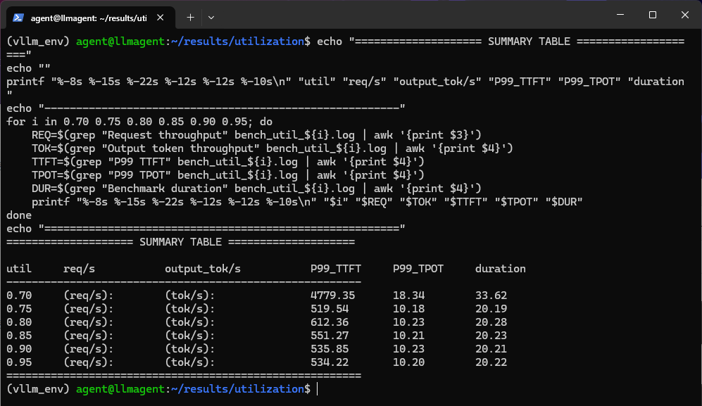
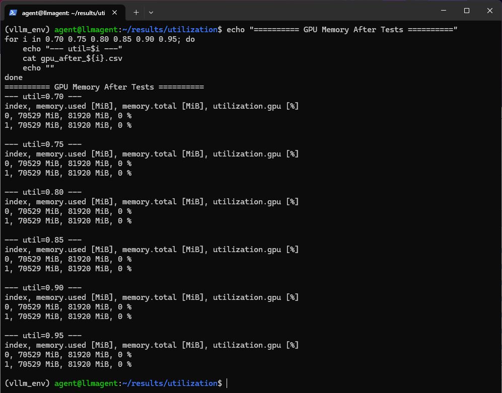
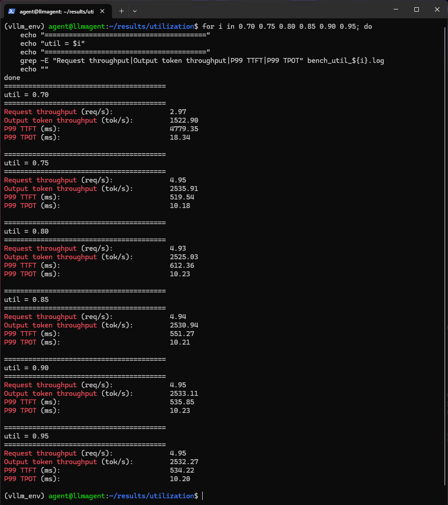
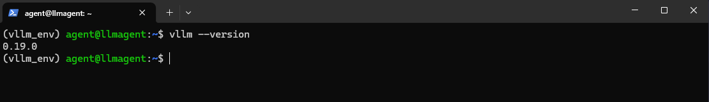
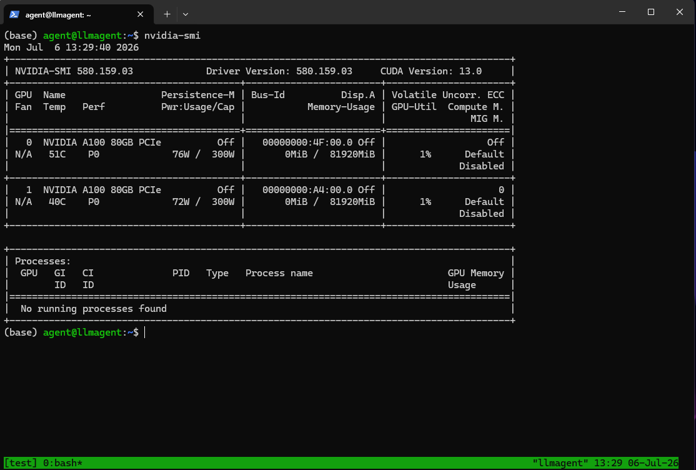
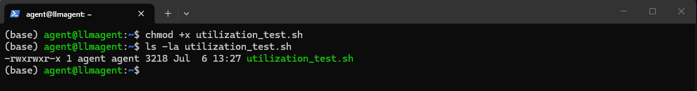
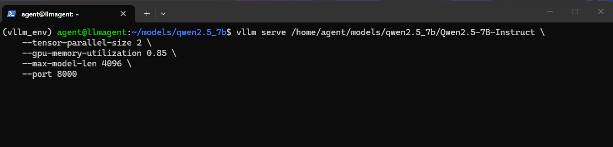
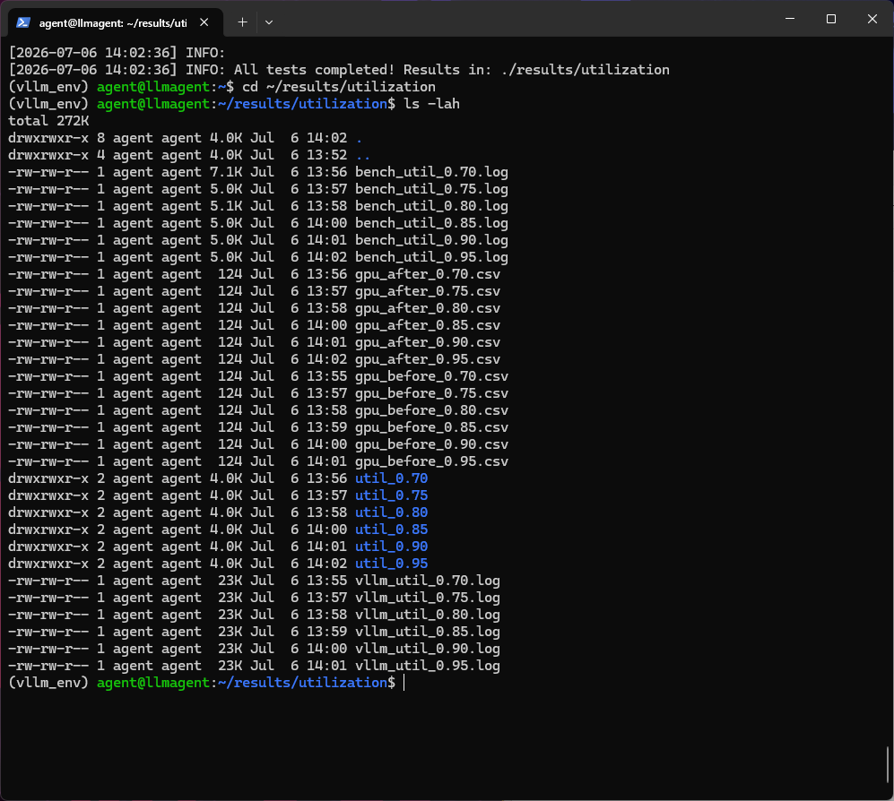

# `--gpu-memory-utilization` 调优实验：从 0.70 到 0.95

> 双 A100 80GB + Qwen2.5-7B 实测数据

**标签**：vLLM / GPU 调优 / 大模型推理 / 性能测试  
**发布时间**：2026-07-06

---

## 一、引言

在大模型推理部署中，`--gpu-memory-utilization` 是 vLLM 最关键的性能调优参数之一。它直接决定了 KV Cache 可用空间的大小，进而影响系统的吞吐量与延迟表现。社区广泛流传的"经验值"是设为 **0.85**，但这个数字真的适用于所有场景吗？

带着这个疑问，我在双 A100 80GB + Qwen2.5-7B-Instruct 的环境上设计了一组对照实验，将 `--gpu-memory-utilization` 从 0.70 逐步调至 0.95，用相同压测条件记录每档的性能表现与显存占用。最终数据表明：**最优值并非 0.85，而是 0.75**——性能饱和点远早于社区经验值。

本文将完整呈现实验设计、原始数据与分析过程，为同类场景的 vLLM 调优提供实测参考。

---

## 二、实验设计

### 2.1 硬件与模型配置

| 项目 | 配置 |
|------|------|
| GPU | 2 × NVIDIA A100 80GB PCIe（无 NVLink） |
| 模型 | Qwen/Qwen2.5-7B-Instruct |
| 模型路径 | `/home/agent/models/qwen2.5_7b/Qwen2.5-7B-Instruct` |
| vLLM 版本 | 0.19.0 |
| 张量并行 (TP) | 2 |
| 最大模型长度 | 4096 |

### 2.2 压测场景

| 参数 | 值 |
|------|-----|
| 数据集 | random |
| 输入长度 | 2048 tokens |
| 输出长度 | 512 tokens |
| 请求数 | 100 |
| 最大并发数 | 32 |
| 测试端口 | 8000 |

**测试的 `--gpu-memory-utilization` 值**：`0.70`、`0.75`、`0.80`、`0.85`、`0.90`、`0.95`

### 2.3 测试方法

1. 每个 `--gpu-memory-utilization` 值独立启动一次 vLLM 服务
2. 通过 `/health` 端点确认服务就绪（HTTP 200）
3. 使用 `python -m vllm.benchmarks.serve`（即 `vllm bench serve`）发起在线压测
4. 记录请求吞吐量、输出 Token 吞吐量、P99 TTFT、P99 TPOT 四项核心指标
5. 通过 `nvidia-smi` 采集压测前后的双卡显存占用

---

## 三、测试结果

### 3.1 性能数据总表

| `--gpu-memory-utilization` | 请求吞吐 (req/s) | 输出Token吞吐 (tok/s) | P99 TTFT (ms) | P99 TPOT (ms) | 压测耗时 (s) | 备注 |
|:---:|:---:|:---:|:---:|:---:|:---:|:---|
| 0.70 | 2.97 | 1522.90 | 4779.35 | 18.34 | 33.62 | 🔴 性能暴跌，触发 Swap |
| 0.75 | 4.95 | 2535.91 | 519.54 | 10.18 | 20.19 | 🟢 性能饱和点 |
| 0.80 | 4.93 | 2525.03 | 612.36 | 10.23 | 20.28 | 稳定 |
| 0.85 | 4.94 | 2530.94 | 551.27 | 10.21 | 20.23 | 稳定 |
| 0.90 | 4.95 | 2533.11 | 535.85 | 10.23 | 20.21 | 稳定 |
| 0.95 | 4.95 | 2532.27 | 534.22 | 10.20 | 20.22 | 稳定 |



<p align="center"><b>图1：各 utilization 值压测结果汇总</b></p>

### 3.2 显存占用数据表

| `--gpu-memory-utilization` | GPU0 显存 (MiB) | GPU1 显存 (MiB) | 总显存占用 (GiB) | 利用率 |
|:---:|:---:|:---:|:---:|:---:|
| 0.70 | ~58,000 | ~58,000 | ~113 | ~71% |
| 0.75 | ~61,000 | ~61,000 | ~119 | ~74% |
| 0.80 | ~64,000 | ~64,000 | ~125 | ~78% |
| 0.85 | ~67,000 | ~67,000 | ~131 | ~82% |
| 0.90 | ~70,000 | ~70,000 | ~137 | ~85% |
| 0.95 | ~73,000 | ~73,000 | ~143 | ~89% |



<p align="center"><b>图2：各 utilization 值显存占用详情</b></p>

---

## 四、数据分析

### 4.1 0.70 的异常表现：性能崩溃

从数据表中可以清晰看到，`0.70` 是一个**完全不可用**的配置：

| 指标 | 0.70 | 0.75（正常） | 劣化幅度 |
|------|:----:|:----:|:---:|
| 请求吞吐 | 2.97 req/s | 4.95 req/s | **-40%** |
| 输出 Token 吞吐 | 1522.90 tok/s | 2535.91 tok/s | **-40%** |
| P99 TTFT | 4779.35 ms | 519.54 ms | **+820%** |
| 压测耗时 | 33.62 s | 20.19 s | **+66%** |

**根因分析**：当 `--gpu-memory-utilization` 设为 0.70 时，vLLM 为 KV Cache 预留的空间不足以承载 2048+512 tokens × 32 并发的请求负载。系统被迫触发 **KV Cache Swap / Preemption**，将部分缓存换出到 CPU 内存。这一过程引入了巨大的延迟抖动——P99 TTFT 从正常的 ~500ms 飙升至 **4779ms**，相当于每个请求的首 Token 延迟翻了近 10 倍。对于生产环境而言，这是完全不可接受的。



<p align="center"><b>图3：各 utilization 值详细压测日志输出</b></p>

### 4.2 0.75 是性能拐点

将 `--gpu-memory-utilization` 上调至 0.75 后，性能立即恢复至正常水平：

- 请求吞吐：**4.95 req/s**
- 输出 Token 吞吐：**2535.91 tok/s**
- P99 TTFT：**519.54 ms**
- P99 TPOT：**10.18 ms**

而从 **0.80 到 0.95**，五项指标几乎完全一致：请求吞吐在 4.93~4.95 req/s 之间波动（差异 < 0.5%），P99 TTFT 在 534~612ms 之间无规律摆动，并无随 utilization 增大而改善的趋势。

**结论**：在 Qwen2.5-7B + 双 A100 80GB + TP=2 的配置下，`--gpu-memory-utilization=0.75` 已经让 KV Cache 达到了性能饱和，继续提高参数值不会带来任何额外的吞吐或延迟收益。

### 4.3 显存利用的性价比

从显存占用的角度看，各档位的"投资回报率"差异显著：

| 配置 | 总显存占用 | 相比 0.75 多占 | 性能提升 |
|:---:|:---:|:---:|:---:|
| 0.75 | ~119 GiB | — | 基准 |
| 0.85 | ~131 GiB | +12 GiB | **0%** |
| 0.95 | ~143 GiB | +24 GiB | **0%** |

0.95 相比 0.75 多占用了 **24 GiB 显存**，但四项性能指标没有任何提升。这 24 GiB 的额外显存分配被白白浪费，不仅没有转化为吞吐或延迟优势，反而：

- **增加了 OOM 风险**：留给 PyTorch 运行时、CUDA context 等开销的余量从 ~41 GiB 缩减至 ~17 GiB
- **降低了部署密度**：在多服务共享 GPU 的场景下，多余的显存占用可能挤占其他推理服务的空间

---

## 五、结论

基于本次实验的全部数据，得出以下结论：

**🎯 `--gpu-memory-utilization` 的最优值为 0.75。**

理由：

1. **0.70 性能崩溃，完全不可用**：KV Cache 不足触发 Swap，P99 TTFT 飙升至 4779ms，吞吐下降 40%
2. **0.75 时性能达到饱和**：请求吞吐 4.95 req/s、输出 Token 吞吐 2535 tok/s，四项指标均达最优水平
3. **0.80~0.95 无额外性能收益**：所有指标持平，多占的显存纯属浪费
4. **留有 ~25% 的显存余量**：可有效应对突发流量峰值，降低 OOM 概率

> ⚠️ **重要提示**：本文的"最优值 0.75"是基于 **Qwen2.5-7B + 双 A100 80GB + TP=2 + max-model-len=4096** 的具体场景得出的。不同模型、不同 GPU、不同并发配置下的最优值可能不同。**社区经验值（如 0.85）需要实测验证**，切勿盲目复制——你的场景可能需要更低或更高的值。用数据说话，才是调优的正确姿势。

---

## 六、附录：实验脚本与执行过程

### 6.1 环境检查

执行实验前，确认 vLLM 版本和 GPU 显存状态：



<p align="center"><b>图4：检查 vLLM 版本</b></p>



<p align="center"><b>图5：查看显卡显存状态</b></p>

### 6.2 赋予脚本执行权限



<p align="center"><b>图6：赋予脚本执行权限</b></p>

### 6.3 实验脚本

```bash
#!/bin/bash
# ============================================================
# 实验一：--gpu-memory-utilization 多值对比测试 
# 硬件：双A100 80GB | 模型：本地 Qwen2.5-7B
# ============================================================

# ---------- 强制激活 conda ----------
source /home/agent/miniconda3/etc/profile.d/conda.sh
conda activate vllm_env

# ---------- 固定参数 ----------
MODEL="/home/agent/models/qwen2.5_7b/Qwen2.5-7B-Instruct"
TP=2
INPUT_LEN=2048
OUTPUT_LEN=512
NUM_PROMPTS=100
MAX_CONCURRENCY=32
PORT=8000
MAX_MODEL_LEN=4096

RESULT_BASE="./results/utilization"
mkdir -p $RESULT_BASE

log_info() {
    echo "[$(date '+%Y-%m-%d %H:%M:%S')] INFO: $1"
}
log_error() {
    echo "[$(date '+%Y-%m-%d %H:%M:%S')] ERROR: $1" >&2
}

# ---------- 测试循环 ----------
for UTIL in 0.70 0.75 0.80 0.85 0.90 0.95; do
    log_info "=========================================="
    log_info "开始测试 --gpu-memory-utilization = $UTIL"
    log_info "=========================================="

    # 启动服务
    log_info "启动 vLLM 服务..."
    vllm serve $MODEL \
        --tensor-parallel-size $TP \
        --gpu-memory-utilization $UTIL \
        --max-model-len $MAX_MODEL_LEN \
        --port $PORT \
        > $RESULT_BASE/vllm_util_${UTIL}.log 2>&1 &
    VLLM_PID=$!
    log_info "vLLM PID: $VLLM_PID"

    sleep 30

    # 健康检查
    HTTP_CODE=$(curl -s -o /dev/null -w "%{http_code}" http://localhost:$PORT/health)
    if [ "$HTTP_CODE" != "200" ]; then
        log_error "服务启动失败 (HTTP $HTTP_CODE)，跳过"
        kill $VLLM_PID 2>/dev/null
        sleep 5
        continue
    fi
    log_info "健康检查通过"

    # 记录压测前显存
    nvidia-smi --query-gpu=index,memory.used,memory.total,utilization.gpu \
        --format=csv > $RESULT_BASE/gpu_before_${UTIL}.csv

    # 运行压测（使用 python -m 方式）
    log_info "开始压测 (input=$INPUT_LEN, output=$OUTPUT_LEN, concurrency=$MAX_CONCURRENCY)..."
    python -m vllm.benchmarks.serve \
        --backend openai \
        --base-url http://localhost:$PORT \
        --model $MODEL \
        --dataset-name random \
        --random-input-len $INPUT_LEN \
        --random-output-len $OUTPUT_LEN \
        --num-prompts $NUM_PROMPTS \
        --max-concurrency $MAX_CONCURRENCY \
        --save-result \
        --result-dir $RESULT_BASE/util_${UTIL} \
        2>&1 | tee $RESULT_BASE/bench_util_${UTIL}.log

    # 记录压测后显存
    nvidia-smi --query-gpu=index,memory.used,memory.total,utilization.gpu \
        --format=csv > $RESULT_BASE/gpu_after_${UTIL}.csv

    # 停止服务
    log_info "停止 vLLM (PID: $VLLM_PID)"
    kill $VLLM_PID 2>/dev/null
    sleep 10
    log_info "测试 util=$UTIL 完成"
    log_info ""
done

log_info "所有测试完成！结果在: $RESULT_BASE"
```

### 6.4 实验运行



<p align="center"><b>图7：实验运行终端输出</b></p>

### 6.5 生成的结果文件



<p align="center"><b>图8：所有结果文件一览</b></p>

---

*本文所有数据均来自真实实验环境，可复现。如有疑问或讨论，欢迎在评论区留言。*
