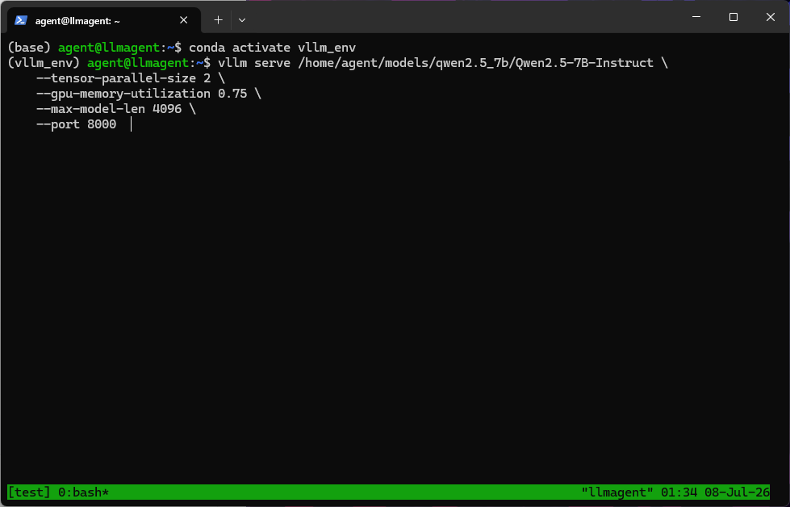
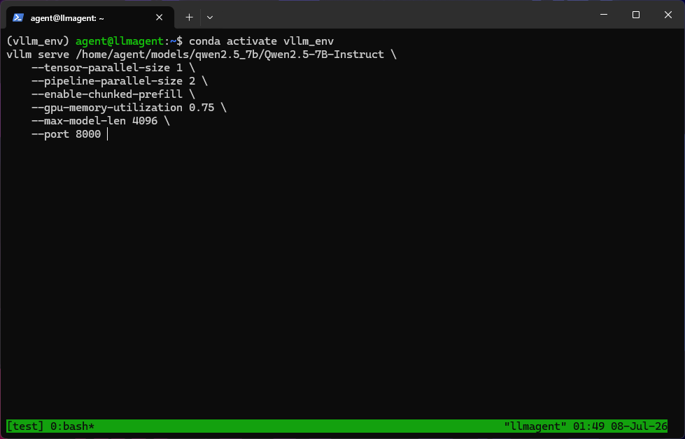
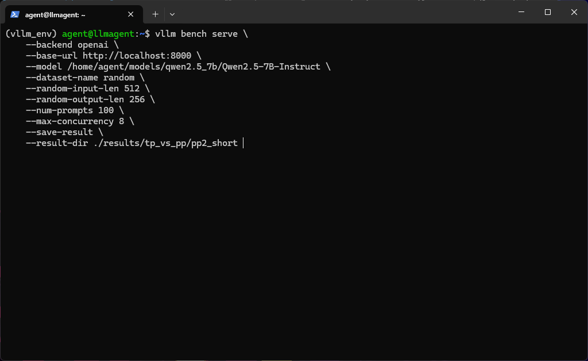

# 张量并行(TP) vs 流水线并行(PP)：双A100无NVLink场景下的实测对比

> 硬件：双 A100 80GB PCIe（无 NVLink）· 模型：Qwen2.5-7B-Instruct · 推理框架：vLLM 0.19.0

## 一、引言

在单机多卡推理部署中，选择哪种并行策略是一个绕不开的问题。vLLM 提供了两种主要的分布式推理方式：**张量并行（Tensor Parallelism, TP）** 和**流水线并行（Pipeline Parallelism, PP）**。社区的一般性建议是"能用 TP 就用 TP"，但这个建议的工程依据是什么？在无 NVLink 的低带宽拓扑下还成立吗？

本实验的目的很明确：在双 A100 80GB PCIe（无 NVLink）服务器上，用完全相同的模型、数据和压测条件，对比 TP=2 与 PP=2 在短文本和长文本两个典型场景下的实际表现。最终数据为这个问题提供了清晰的答案——**流水线并行的"气泡"在单机双卡场景下是致命的**。

> 这个实验也直接回答了一个高频面试问题："你为什么用张量并行而不是流水线并行？"——读完本文，你将拥有用数据支撑的完整回答。

## 二、实验设计

### 2.1 硬件与模型配置

| 项目 | 配置 |
|:---|:---|
| GPU | 2 × NVIDIA A100 80GB PCIe（**无 NVLink**，GPU 间经 PCIe Switch 通过 CPU 通信） |
| GPU 互联 | `SYS`（PCIe 4.0 ×16，单向理论带宽约 32 GB/s） |
| 模型 | Qwen/Qwen2.5-7B-Instruct（FP16 权重约 14 GB） |
| vLLM 版本 | 0.19.0 |

**对比的两组配置**：

| 编号 | 并行策略 | 启动参数关键项 |
|:---|:---|:---|
| TP=2 | 张量并行 | `--tensor-parallel-size 2` |
| PP=2 | 流水线并行 | `--pipeline-parallel-size 2 --enable-chunked-prefill` |

> PP=2 启用了 `--enable-chunked-prefill`，这是 vLLM 对流水线并行的关键优化——将单个请求的预填充阶段切分成多个 chunk，使 GPU 间可以流水化执行，部分缓解气泡问题。不开启此选项的 PP 性能会更差。

### 2.2 测试场景

覆盖两个典型生产负载：

| 场景 | 输入长度 | 输出长度 | 并发数 | 请求数 | 模拟场景 |
|:---|:---|:---|:---|:---|:---|
| 短文本低并发 | 512 tokens | 256 tokens | 8 | 100 | 对话、RAG 问答 |
| 长文本高并发 | 2048 tokens | 512 tokens | 32 | 100 | 文档摘要、长上下文推理 |

### 2.3 统一配置

两组实验除并行策略外，所有参数保持一致，且均沿用实验一的最优结论：

| 参数 | 值 | 说明 |
|:---|:---|:---|
| `--gpu-memory-utilization` | 0.75 | 经实验一验证的最优值 |
| `--max-model-len` | 4096 | 覆盖测试所需的最大上下文 |
| 压测工具 | `vllm bench serve` | vLLM 内置 benchmark |
| 数据集 | `random` | 排除具体内容偏差 |

## 三、测试结果

### 3.1 短文本场景（512/256，并发 8）



<p align="center"><b>图1：TP=2 服务启动成功</b></p>

运行压测.png)

<p align="center"><b>图2：TP=2 短文本场景压测输出</b></p>



<p align="center"><b>图3：PP=2 服务启动成功（含 --enable-chunked-prefill）</b></p>



<p align="center"><b>图4：PP=2 短文本场景压测输出</b></p>

| 指标 | TP=2（张量并行） | PP=2（流水线并行） | 差距 |
|:---|:---:|:---:|:---|
| 请求吞吐 (req/s) | **2.86** | 1.37 | **TP 领先 108%** |
| 输出 Token 吞吐 (tok/s) | **676.87** | 332.21 | **TP 领先 104%** |
| P99 TTFT (ms) | 457.96 | **368.97** | PP 更优 |
| P99 TPOT (ms) | **13.29** | 26.43 | **TP 领先 99%** |
| 压测耗时 (s) | **34.95** | 72.79 | **TP 快 108%** |

**关键发现**：短文本场景下，TP=2 的请求吞吐和输出 Token 吞吐均为 PP=2 的 **2 倍以上**。PP=2 仅在 P99 TTFT 上有微弱优势（369 ms vs 458 ms），但在吞吐量这个核心产能指标上差距悬殊——PP=2 处理完 100 个请求耗时 72.79 秒，而 TP=2 仅需 34.95 秒。

### 3.2 长文本场景（2048/512，并发 32）

进行压测.png)

<p align="center"><b>图5：TP=2 长文本场景压测输出</b></p>


<p align="center"><b>图6：PP=2 长文本场景压测输出</b></p>

| 指标 | TP=2（张量并行） | PP=2（流水线并行） | 差距 |
|:---|:---:|:---:|:---|
| 请求吞吐 (req/s) | **2.80** | 0.98 | **TP 领先 186%** |
| 输出 Token 吞吐 (tok/s) | **1336.89** | 479.81 | **TP 领先 179%** |
| P99 TTFT (ms) | 5062.23 | **3029.51** | PP 更优 |
| P99 TPOT (ms) | 151.95 | **65.70** | PP 更优 |
| 压测耗时 (s) | **35.73** | 102.21 | **TP 快 186%** |

**关键发现**：长文本场景下，TP=2 的优势被进一步放大——吞吐差距从短文本的约 2 倍扩大到 **近 3 倍**。PP=2 的 P99 TTFT 和 P99 TPOT 依然优于 TP=2（这是流水线并行固有的首 Token 延迟优势），但在 100 个请求需要近 2 分钟才能跑完的现实面前，这些微弱的延迟优势已经没有实际意义。

## 四、原因分析

### 4.1 流水线气泡（Pipeline Bubble）—— 性能折半的根本原因

流水线并行的核心问题在于**气泡（Bubble）**。以 PP=2、模型有 N 层 Transformer 为例：

```
时间轴 →
GPU0: [层 1~N/2 计算] [空闲等待] [层 1~N/2 计算] [空闲等待] ...
GPU1: [空闲等待] [层 N/2+1~N 计算] [空闲等待] [层 N/2+1~N 计算] ...
```

在任一时刻，只有一张 GPU 在真正执行计算，另一张处于空闲状态。这种"轮流干活"的模式导致**硬件利用率不超过 50%**——你在为两张 A100 付费，但任何时候最多只有一张卡在跑矩阵乘法。

气泡的数学本质也很直观：对于一个有 K 个阶段的流水线，处理单个请求时 GPU 的理论利用率上限为 1/K。PP=2 时利用率上限就是 50%，从原理上决定了吞吐量不可能达到 TP 的水平。而实测数据中 PP 吞吐恰好约为 TP 的一半，说明气泡是压倒性的性能瓶颈，其他因素（如通信开销）的影响相比之下可以忽略。

### 4.2 通信开销可控——All-Reduce 在 7B 模型下不是瓶颈

张量并行在每层 Transformer 的 MLP 和 Attention 计算后都需要插入一次 **All-Reduce** 同步，将所有 GPU 的部分结果汇总。在无 NVLink（`SYS` 拓扑）下，这个通信走 PCIe 4.0 ×16，延迟确实不可忽略——这也是实验中 TP=2 的 P99 TTFT 反而不如 PP=2 的直接原因。

但关键点在于：Qwen2.5-7B 的隐藏层维度为 3584，单层 All-Reduce 的通信量在数 MB 级别，通过 32 GB/s 的 PCIe 带宽只需几十微秒即可完成。而 PP 的气泡导致的 GPU 空闲时间以**数十毫秒**计——通信开销与气泡浪费之间差了三个数量级。

换句话说：TP 用几十微秒的通信换来了两张 GPU 同时计算；PP 省下了通信却付出了 50% 时间空转的代价。在这个量级对比下，TP 显然划算得多。

### 4.3 长文本放大气泡效应——计算越久，气泡越致命

对比短文本和长文本的差距变化，可以更直观地理解气泡的破坏力：

| 场景 | TP 吞吐 | PP 吞吐 | TP 领先幅度 |
|:---|:---:|:---:|:---|
| 短文本（512 tokens） | 2.86 req/s | 1.37 req/s | **+108%** |
| 长文本（2048 tokens） | 2.80 req/s | 0.98 req/s | **+186%** |

长文本的预填充阶段涉及 4 倍于短文本的 token 数，自注意力计算的复杂度与序列长度的平方成正比，因此单次前向的计算时间大幅增加。在 PP 的流水线中，每个气泡的"宽度"（即 GPU 等待时间）与单次计算时间成正比——计算越久，气泡浪费的绝对时间越多。这解释了为什么 PP 的性能劣势从短文本的 108% 放大到了长文本的 186%。

这也意味着一个残酷的推论：**模型越大、序列越长，PP 的劣势越明显**。对于 70B 级别的大模型，长文本场景下 PP 的性能可能与 TP 的差距达到数倍——如果只有两张卡，PP 几乎不应该被列入考察选项。

## 五、结论与建议

基于以上数据和分析，结论明确：

**在单机双卡无 NVLink 场景下，张量并行（TP）在吞吐量上完胜流水线并行（PP）。**

| 维度 | TP=2 | PP=2 |
|:---|:---|:---|
| 短文本吞吐 | 2.86 req/s | 1.37 req/s（仅为 TP 的 48%） |
| 长文本吞吐 | 2.80 req/s | 0.98 req/s（仅为 TP 的 35%） |
| P99 TTFT（长文本） | 5062 ms | 3030 ms（PP 更优，但无实际意义） |
| GPU 利用率 | 双卡同时计算 | 轮流空闲，利用率 ≤ 50% |
| 综合推荐 | **首选** | 不推荐（单机双卡场景） |

### 决策建议

1. **单机双卡部署 7B~13B 模型时，首选 TP=2**。即使没有 NVLink，TP 的 All-Reduce 通信开销在 7B 级别模型上也完全可控，远小于 PP 的气泡浪费。
2. **PP 的首 Token 延迟优势不具备实际说服力**。虽然 PP 在 P99 TTFT 上数字更好看，但当一个请求在 PP 下需要排队多等一倍时间才能开始服务时（整体吞吐减半），首 Token 快了几百毫秒已经没有意义——用户的总等待时间只会更长。
3. **PP 的适用场景在别处**——跨节点推理（多机多卡）。当 GPU 分布在不同的物理节点上时，跨节点通信延迟远高于机内 PCIe/SYS，此时 TP 的每层同步会因网络瓶颈而变得不可接受，PP 因其极低的通信频率（仅在前半/后半交接处传递一次中间激活）反而成为更合理的选择。但在单机内部，PP 没有竞争力。
4. **本文结论与前一篇实验一联动**：将 `--gpu-memory-utilization` 设为 0.75（实验一的最优值）配合 TP=2，是当前硬件环境下 Qwen2.5-7B 的最优部署组合。

### 面试场景速记

> "在双 A100 无 NVLink 场景下，我系统对比了 TP=2 和 PP=2。实测数据显示：短文本场景 TP 吞吐是 PP 的 2 倍，长文本场景 TP 吞吐是 PP 的近 3 倍。根本原因是流水线并行存在'气泡'——PP=2 时任一时刻只有一张 GPU 在计算，硬件利用率不超过 50%。TP 虽然每层都要做 All-Reduce，但 Qwen2.5-7B 单层权重小，PCIe 带宽完全够用，几十微秒的通信开销远小于 PP 几十毫秒的气泡浪费。因此单机双卡场景我坚定选择张量并行。"

## 六、附录：测试命令

### TP=2 启动与压测

```bash
# 启动 TP=2 服务
vllm serve /path/to/Qwen2.5-7B-Instruct \
    --tensor-parallel-size 2 \
    --gpu-memory-utilization 0.75 \
    --max-model-len 4096 \
    --port 8000

# 短文本压测（512/256, 并发8）
python -m vllm.benchmarks.serve \
    --backend openai \
    --base-url http://localhost:8000 \
    --model /path/to/Qwen2.5-7B-Instruct \
    --dataset-name random \
    --random-input-len 512 \
    --random-output-len 256 \
    --num-prompts 100 \
    --max-concurrency 8

# 长文本压测（2048/512, 并发32）
python -m vllm.benchmarks.serve \
    --backend openai \
    --base-url http://localhost:8000 \
    --model /path/to/Qwen2.5-7B-Instruct \
    --dataset-name random \
    --random-input-len 2048 \
    --random-output-len 512 \
    --num-prompts 100 \
    --max-concurrency 32
```

### PP=2 启动与压测

```bash
# 启动 PP=2 服务（启用 chunked-prefill 以缓解气泡）
vllm serve /path/to/Qwen2.5-7B-Instruct \
    --pipeline-parallel-size 2 \
    --enable-chunked-prefill \
    --gpu-memory-utilization 0.75 \
    --max-model-len 4096 \
    --port 8000

# 压测命令同上（仅 --base-url 保持一致即可）
```

### 关键参数速查

| 参数 | TP=2 | PP=2 |
|:---|:---|:---|
| 并行策略 | `--tensor-parallel-size 2` | `--pipeline-parallel-size 2` |
| 气泡缓解 | 无需额外参数 | `--enable-chunked-prefill`（必须） |
| 显存利用 | `--gpu-memory-utilization 0.75` | `--gpu-memory-utilization 0.75` |

---

*测试环境：双 A100 80GB PCIe（无 NVLink，SYS 拓扑）· vLLM 0.19.0 · Qwen2.5-7B-Instruct · 2026 年 7 月*
